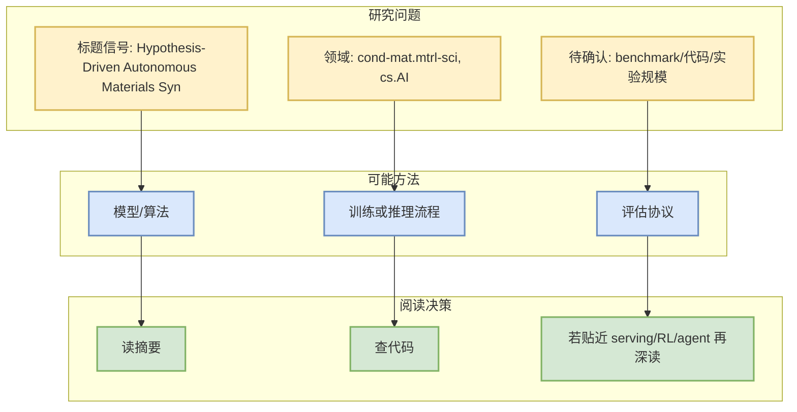
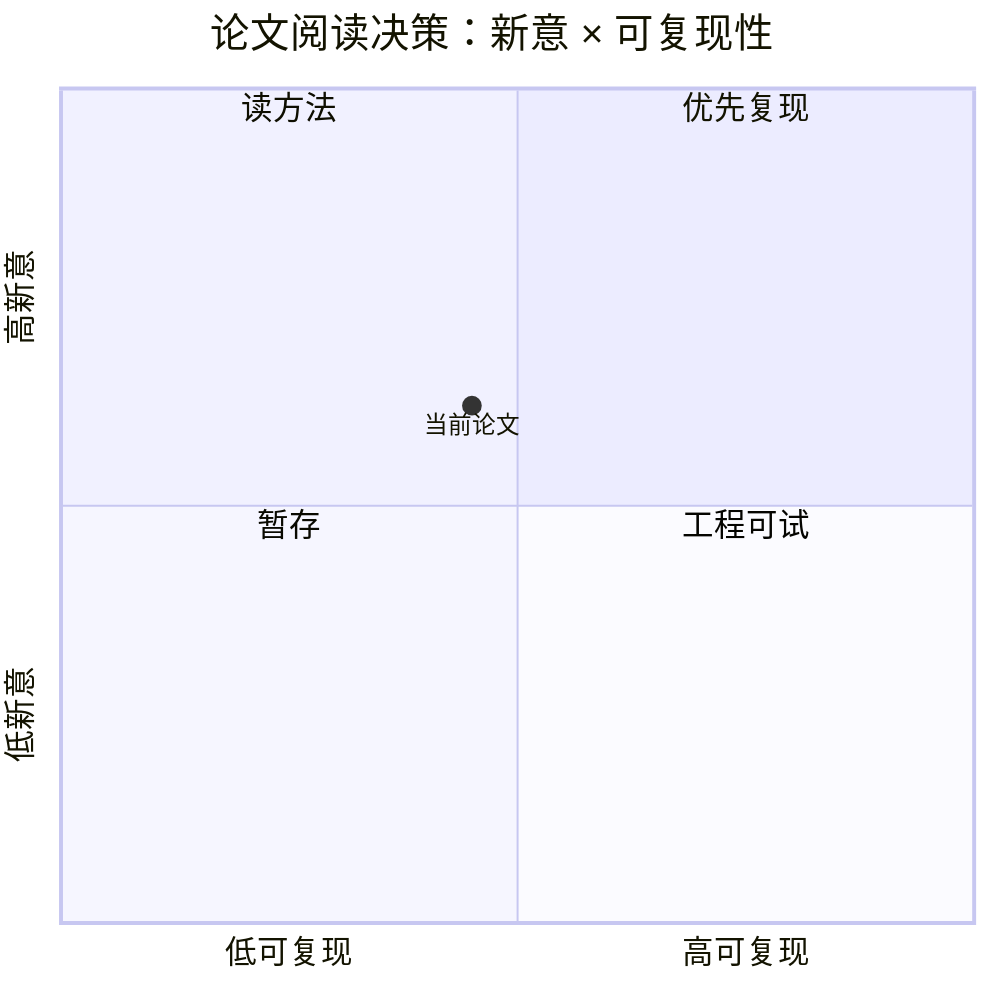

# Hypothesis-Driven Autonomous Materials Synthesis with Multimodal LLM Agents

> 类型：论文
> 大类：论文
> 小类：AI Infra / LLM / RL / Agent
> 推荐等级：可 skim
> 创建日期：2026-09-17
> 原文链接：https://arxiv.org/abs/2609.18598v1
> PDF：https://arxiv.org/pdf/2609.18598v1
> 返回日报：[[Daily/2026-09-17]]

## 一句话结论

这篇论文被今日 arXiv 扫描命中，主题与 LLM/RL/Agent/Serving 相关，适合作为低到中置信候选继续筛。

## 论文信息

| 字段 | 内容 |
|---|---|
| 论文来源 | arXiv |
| 来源类型 | 预印本 / 论文索引 |
| 作者/机构 | Izumi Takahara, Kazunori Nishio, Akira Aiba, Shigeru Kobayashi |
| 发布时间 | 2026-09-16 |
| arXiv | [abs](https://arxiv.org/abs/2609.18598v1) |
| PDF | [pdf](https://arxiv.org/pdf/2609.18598v1) |
| 代码 | 未发现 |
| Categories | cond-mat.mtrl-sci, cs.AI |

## 方法/系统图示

## 摘要压缩

Self-driving laboratories can explore synthesis conditions autonomously, but their decision-making layer is typically a black-box optimizer, and the output is a set of optimized samples, with the measurements reduced to predefined scalar objectives and the reasons behind success left unarticulated. Here we present SynAgent, a framework in which large language model agents operate an automated experimental system and maintain an explicit, revisable understanding of the synthesis process as the campaign's primary output. Starting with no predefined analysis pipeline, SynAgent adaptively generates analysis skills for newly acquired data and evolves this understanding through multimodal reasoning over experimental data such as X-ray diffraction patterns and electron micrographs. The evolution is guided by a verify-falsify scheme, in which the agent deliberately challenges its own hypotheses by testing conditions predicted to fail as well as those predicted to succeed. In a single campaign of 18 autonomous experiments using LiCoO2 (001) thin-film deposition as a testbed, SynAgent synthesized highly crystalline films and evolved an understanding of how the substrate temperature governs crystallization, discovering an abrupt threshold and a narrow optimal growth window at 650-690 °C. These results extend autonomous experimentation beyond optimized samples to testable, human-readable understanding.

## 对我的影响

| 维度 | 影响 | 建议动作 |
|---|---|---|
| AI Infra | 先确认是否有系统/Serving/训练效率贡献 | skim |
| LLM 工程 | 看是否涉及模型训练、推理或 eval | 读摘要 |
| RL / Game AI | 若涉及 RL/world model/imperfect information，可后续深挖 | 加入观察 |
| Agent / Eval | 若涉及 agent evaluation，可纳入 benchmark 列表 | 查实验 |

## 相关链接

- 原文：https://arxiv.org/abs/2609.18598v1
- PDF：https://arxiv.org/pdf/2609.18598v1

## 标签

#ai-radar #paper
