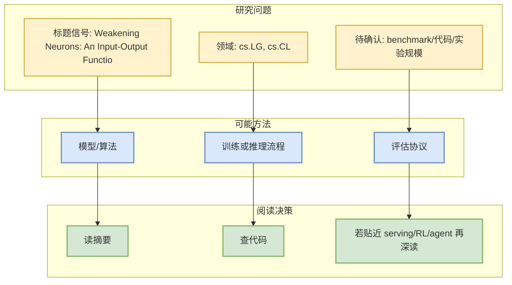
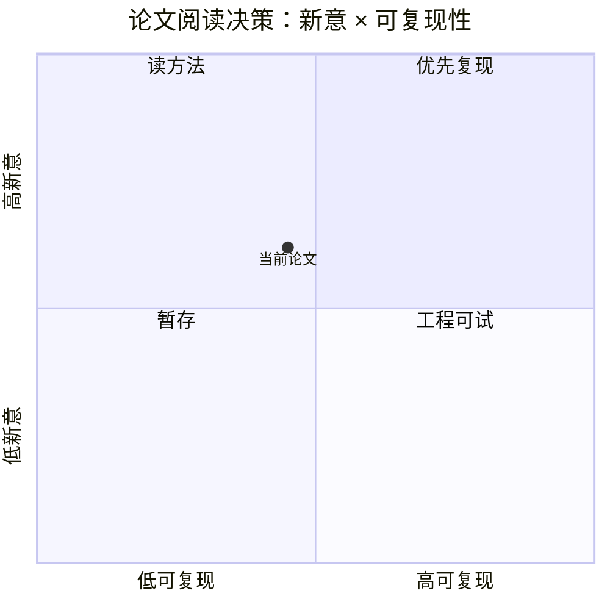

# Weakening Neurons: An Input-Output Functionality in Transformers with Outsize Influence

> 类型：论文
> 大类：论文
> 小类：AI Infra / LLM / RL / Agent
> 推荐等级：可 skim
> 创建日期：2026-09-17
> 原文链接：https://arxiv.org/abs/2609.18612v1
> PDF：https://arxiv.org/pdf/2609.18612v1
> 返回日报：[[Daily/2026-09-17]]

## 一句话结论

这篇论文被今日 arXiv 扫描命中，主题与 LLM/RL/Agent/Serving 相关，适合作为低到中置信候选继续筛。

## 论文信息

| 字段 | 内容 |
|---|---|
| 论文来源 | arXiv |
| 来源类型 | 预印本 / 论文索引 |
| 作者/机构 | Sebastian Gerstner, Hilal AlQuabeh, Kentaro Inui, Hinrich Schütze |
| 发布时间 | 2026-09-16 |
| arXiv | [abs](https://arxiv.org/abs/2609.18612v1) |
| PDF | [pdf](https://arxiv.org/pdf/2609.18612v1) |
| 代码 | 未发现 |
| Categories | cs.LG, cs.CL |

## 方法/系统图示

## 摘要压缩

We analyze the learned input-output behavior of GLU-based neurons in large language models (LLMs). We propose a simple analysis method: For each neuron, we compute the cosine similarities between its input (reading) and output (writing) weight vectors. In this scheme, a strong negative cosine similarity indicates the neuron weakens the direction it detects in the residual stream, so we call this a weakening neuron. This allows us to gain a number of novel insights. First, we show that nine different LLMs have similar patterns: weakening neurons appear mostly in late layers whereas their counterparts, (conditional) strengthening neurons, are frequent in early-middle layers. Second, we find that weakening neurons display surprising behavior: even though there are few, they activate often and have a large influence on model behavior. Third, weakening neurons have a strong effect on model output when gate values are negative -- which is surprising since negative gate values are not expected to encode functionality.

## 对我的影响

| 维度 | 影响 | 建议动作 |
|---|---|---|
| AI Infra | 先确认是否有系统/Serving/训练效率贡献 | skim |
| LLM 工程 | 看是否涉及模型训练、推理或 eval | 读摘要 |
| RL / Game AI | 若涉及 RL/world model/imperfect information，可后续深挖 | 加入观察 |
| Agent / Eval | 若涉及 agent evaluation，可纳入 benchmark 列表 | 查实验 |

## 相关链接

- 原文：https://arxiv.org/abs/2609.18612v1
- PDF：https://arxiv.org/pdf/2609.18612v1

## 标签

#ai-radar #paper
