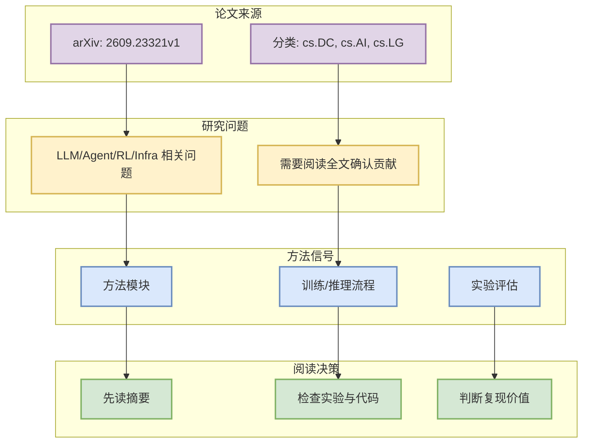

# Co-occurrence Patterns of LoRA Adapters in Production Diffusion Model Inference Services

> 日期：2026-09-22  
> 论文来源：arXiv  
> 来源类型：预印本 / 论文索引  
> abs：https://arxiv.org/abs/2609.23321v1  
> PDF：https://arxiv.org/pdf/2609.23321v1

## 一句话结论
这篇论文进入今日低/中置信论文观察列表；需要阅读全文后再决定是否复现，但主题命中 AI Infra / LLM / Agent / RL Radar 查询。

## TL;DR
- arXiv ID：2609.23321v1
- 作者/机构：Tao Zhang, Bin Liao, Tao Zhou, Yanping Liu
- 发布时间：2026-09-20
- 分类：cs.DC, cs.AI, cs.LG
- 摘要压缩：Low-rank adaptation (LoRA) has become a key technology for serving large-scale personalized large language models and diffusion models in the cloud. However, the co-occurrence patterns, resource contention relationships, and evolutionary regularities of adapters under production inference workloads have not been systematically or quantitatively studied. Based on GenTD26, Alibaba's production diffusion model inference dataset, this paper adopts a graph-theoretic framework to construct an adapter co-occurrence network and conducts a characterization from both static structure and dynamic evoluti
- 代码链接：未发现

## 论文机制图

## 影响矩阵
| 维度 | 判断 |
|---|---|
| 对 AI Infra | 若涉及 serving/training/eval，可进入后续深读。 |
| 对 RL / Game AI | 若涉及 RL、world model 或 imperfect information，可映射到 Rummy bot/evaluator。 |
| 可信度 | arXiv 元数据可验证；未读 PDF 全文，结论低/中置信。 |
| 下一步 | 阅读 PDF，补充方法、实验和代码链接。 |

## 相关链接
- abs：https://arxiv.org/abs/2609.23321v1
- PDF：https://arxiv.org/pdf/2609.23321v1
- GitHub 网页详情：https://github.com/dyt27666-oss/AI-news-report-obsidians/blob/main/Papers/2026-09-22/2609-23321v1-co-occurrence-patterns-of-lora-adapters-in-product.md

#ai-radar #paper #arxiv
