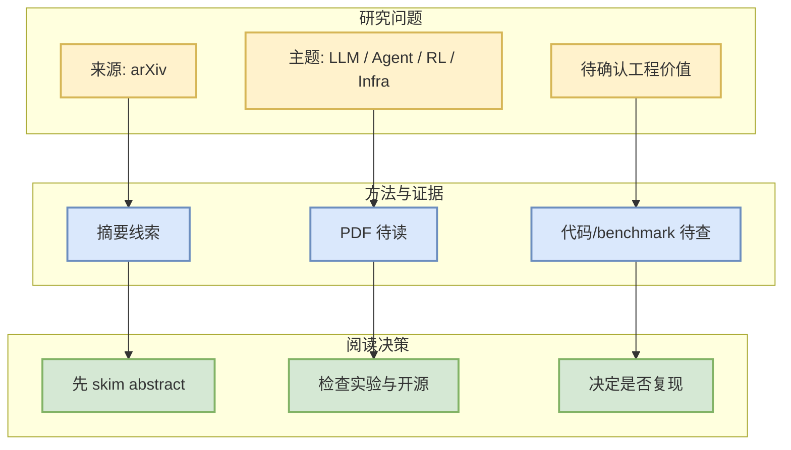

# PACT: From Credit Assignment to Critic Alignment

> 来源：arXiv  
> 来源类型：预印本 / API 查询候选  
> arXiv ID：2609.26355v1  
> 原文：https://arxiv.org/abs/2609.26355v1  
> PDF：https://arxiv.org/pdf/2609.26355v1

## 一句话结论
该论文命中今日 AI Infra / LLM / Agent / RL 相关查询，建议作为候选阅读；未阅读全文前不夸大结论。

## TL;DR
- 作者/机构：Jiayan Fu, Hang Xu, Yong Zhang, Zhaokai Luo, Yao Hu
- 分类：cs.LG, cs.AI
- 摘要：Reinforcement learning has become a central component of large language model (LLM) post-training, yet token-level credit lacks a generally accepted mathematical definition, leaving its relationship to commonly used training signals unclear. We formulate three regularity conditions, namely Completeness, Prefix Consistency, and Neutrality, and prove that they uniquely determine token-level credit. This characterization provides a unified basis for explaining phenomena across existing algorithms …

## 信息压缩图示

## 专业解读
当前只基于 arXiv 元数据筛选。若论文涉及 serving、post-training、agent eval 或 RL rollout，需要进一步检查实验设置、代码链接和可复现性。

## 相关链接
- abs：https://arxiv.org/abs/2609.26355v1
- PDF：https://arxiv.org/pdf/2609.26355v1
- 日报：[[Daily/2026-09-23]]

#ai-radar #paper #arxiv
