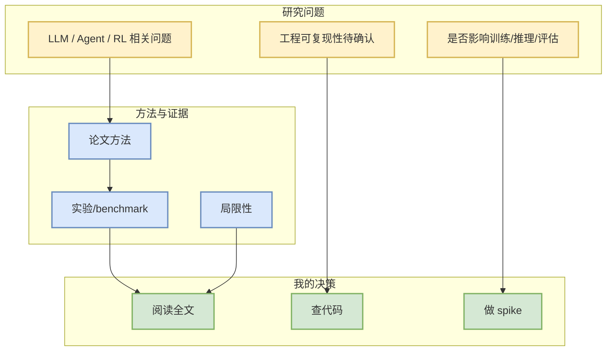

# Improving Ensemble Filters with Flow Matching

> 论文来源：arXiv  
> 来源类型：预印本 / 论文索引  
> 作者/机构：Haoyuan Chen, Alexandre Thiéry  
> 发布时间：2026-09-23  
> abs：https://arxiv.org/abs/2609.28015v1  
> PDF：https://arxiv.org/pdf/2609.28015v1  
> 代码链接：未发现

## 一句话结论
该论文进入今日 AI Radar 论文候选；需进一步阅读全文确认是否能转化为 serving、post-training、agent eval 或 RL/game AI 实验。

## TL;DR
Data assimilation estimates a dynamical state from partial and noisy observations. Classical ensemble filters are efficient but restrict analysis updates through finite sample covariance and affine Gaussian distribution.

## 信息压缩图示

## 专业解读
当前仅基于 arXiv 元数据和摘要进行筛选。若摘要涉及 agent、reinforcement learning、LLM inference、post-training 或 evaluation，应进入后续精读队列；否则维持可 skim / 低置信。

## 影响矩阵
| 方向 | 可能价值 | 跟进 |
|---|---|---|
| Serving / Inference | 需看是否有系统指标 | 查实验章节 |
| RL / Post-training | 需看奖励、rollout、credit assignment | 查方法和代码 |
| Agent / Eval | 需看 benchmark 设计 | 对照现有 eval loop |

## 相关链接
- abs：https://arxiv.org/abs/2609.28015v1
- PDF：https://arxiv.org/pdf/2609.28015v1
- 今日日报：[[Daily/2026-09-24]]

#ai-radar #paper #arxiv
