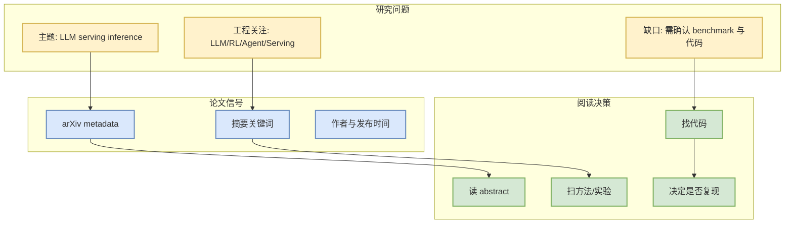

# REAT: A Reflective Experience-Augmented Tutoring Framework for Multi-turn Mathematical Instruction

> 日期：2026-09-25  
> 论文来源：arXiv  
> 来源类型：预印本 / metadata watchlist  
> 发布时间：2026-09-24  
> abs：https://arxiv.org/abs/2609.29804v1  
> PDF：https://arxiv.org/pdf/2609.29804v1

## 一句话结论
这篇论文由自动 arXiv 查询 `LLM serving inference` 捕获，主题与 LLM / agent / RL / serving 相关，但仍需阅读全文确认实验质量与工程可复现性。

## TL;DR
- 作者/机构：Jianheng Zhou, Chaoli Zhang, Xingjun Wei, Xinliang Zhou
- 摘要压缩：Current Large Language Models (LLMs) excel at solving complex mathematical problems, yet this proficiency does not inherently translate into effective
- 代码链接：未发现
- Semantic Scholar / OpenReview / 会议页：未验证

## 信息压缩图示

## 专业解读
该条目前只作为论文候选。若与 serving / post-training / agent eval 强相关，下一步应检查任务定义、数据集、baseline、公平性、训练成本和开源实现。

## 影响矩阵
| 维度 | 判断 |
|---|---|
| AI Infra | 关注是否改变推理、训练或评测 pipeline |
| RL / Game AI | 关注是否有 environment、rollout、reward 或 world model 信号 |
| 工程可复现 | 未读全文，暂列可 skim |

## 可信度与局限性
仅基于 arXiv metadata；没有阅读全文，不应当作最终论文解读。

## 相关链接
- abs：https://arxiv.org/abs/2609.29804v1
- PDF：https://arxiv.org/pdf/2609.29804v1
- Daily：[[Daily/2026-09-25]]

#ai-radar #paper #arxiv
