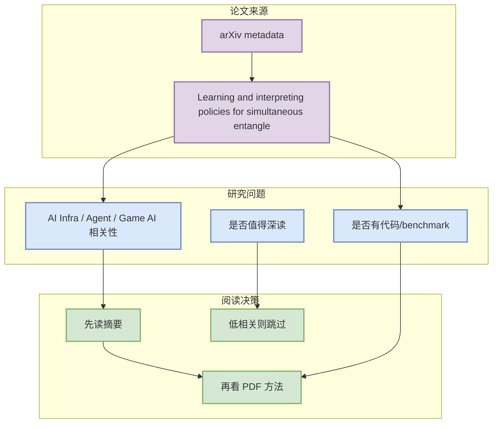

# Learning and interpreting policies for simultaneous entanglement requests in quantum networks

> 一句话结论：这是今日 arXiv metadata 候选，尚未阅读全文；仅作为 AI Infra / Agent / Game AI skim 队列。

## TL;DR
- 论文来源：arXiv
- 来源类型：预印本 / 论文索引 metadata
- 作者/机构：Leon Rode, Sumeet Khatri, Supartha Podder
- 发布时间：2026-09-24
- abs：https://arxiv.org/abs/2609.30157v1
- PDF：https://arxiv.org/pdf/2609.30157v1
- 分类：quant-ph, cs.LG

## 信息压缩图示

## 摘要压缩
Future quantum networks will make use of entanglement to perform numerous tasks, such as sending quantum information over long distances, distributed quantum computing, and quantum

## 可信度与局限性
- 仅抓取 metadata，未阅读全文。
- 需要确认是否真与 serving、training、agent eval、RL/Game AI 强相关。

#ai-radar #paper #arxiv
