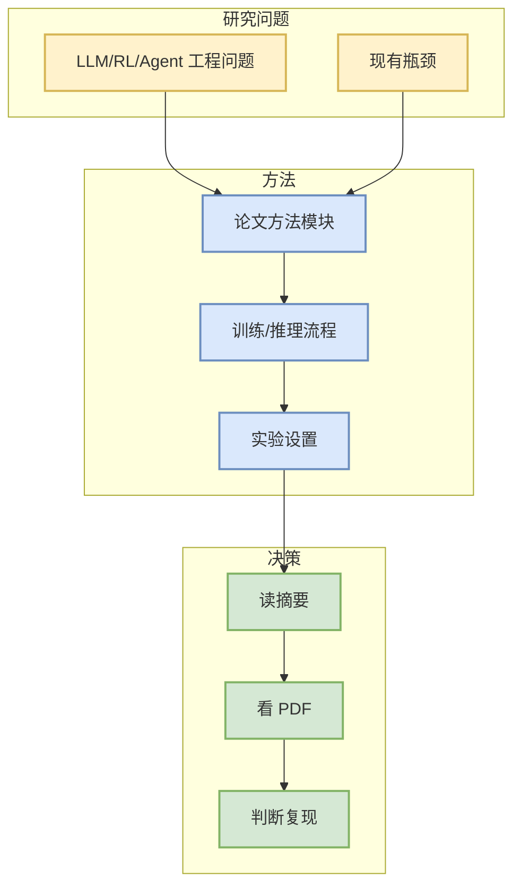

# Beyond Token Importance: Preserving Spatial Scaffolds for Efficient Vision-Language-Action Inference

> 一句话结论：Existing VLA pruning strategies primarily select individual visual tokens according to task-level semantic relevance, while overlooking the spatial information required for robotic manipulation. To examine this limitation, we construct a simple Stride baseline that uniformly samples tokens along the flattened one-dimensional visual sequence, representing a p

## TL;DR
- 论文来源：arXiv
- 来源类型：预印本
- 作者/机构：Jiayu Chen, Shuyong Gao, Jingkai Jia, Xiaosheng Bu
- 发布时间：2026-09-29
- abs：https://arxiv.org/abs/2609.36967v1
- PDF：https://arxiv.org/pdf/2609.36967v1
- 代码链接：未发现

## 信息压缩图示

## 专业解读
这篇论文被纳入 AI Radar 是因为其查询主题与 LLM serving、post-training、agent eval、world model/RL 或 game AI 相关。需要进一步核对全文中的 benchmark、训练成本、baseline 和复现难度。

## 通俗解释
先把它当作候选论文：如果摘要中的问题正好对应当前工程瓶颈，再进入精读。

## 关键机制拆解
| 项 | 内容 |
|---|---|
| 研究问题 | Existing VLA pruning strategies primarily select individual visual tokens according to task-level semantic relevance, while overlooking the spatial information required for robotic manipulation. To examine this limitation, we construct a simple Stride baseline that uniformly samples tokens along the flattened one-dimensional visual sequence, representing a p |
| 工程价值 | 可能影响模型训练、推理或 agent/eval 工作流 |
| 局限 | 自动摘要级筛选，未完成全文复现 |

## 对我的影响
若涉及 RL/post-training，可关注 reward、rollout、并行环境；若涉及 serving，可关注吞吐、延迟和缓存；若涉及 agent eval，可关注 benchmark 构造与失败分析。

## 相关链接
- abs：https://arxiv.org/abs/2609.36967v1
- PDF：https://arxiv.org/pdf/2609.36967v1

#ai-radar #paper
