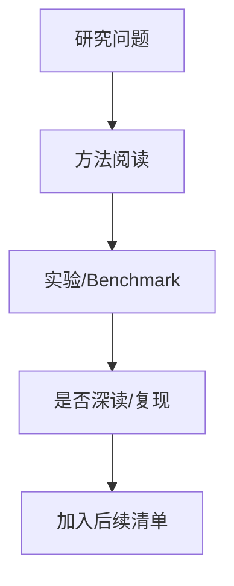

# arXiv 获取失败或无强相关候选

> 类型：论文
> 论文来源：arXiv
> 来源类型：预印本 / 论文索引
> 推荐等级：后续
> 原文链接：https://arxiv.org/
> PDF：https://arxiv.org/
> 返回日报：[[Daily/2026-10-02]]

## 一句话结论
这是今日 arXiv 摘要级候选；需要后续阅读全文确认是否真正适合复现或工程落地。

## TL;DR
- **研究问题**：The read operation timed out
- **作者/机构**：未获取
- **发布时间**：未获取

## 方法/系统图示

## 对我的影响
| 维度 | 影响 | 建议动作 |
|---|---|---|
| AI Infra | 待确认 | 看是否涉及 serving/training/eval |
| LLM 工程 | 待确认 | 读 method |
| RL / Game AI | 待确认 | 查环境和 reward |
| Agent / Eval | 待确认 | 查 benchmark |

## 标签
#ai-radar #paper
