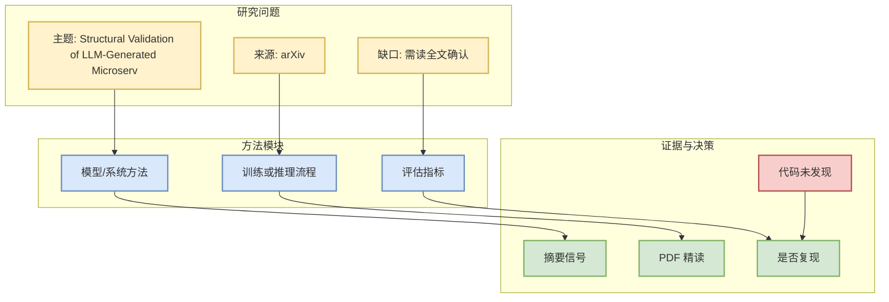

# Structural Validation of LLM-Generated Microservice Decompositions Using Source-Code Dependencies

> 论文来源：arXiv  
> 来源类型：预印本 / 论文索引  
> 发布时间：2026-07-30  
> 作者/机构：Daniel Silva, Renan Alves, Emanuel Dantas Filho, Ademar Sousa Neto, Mirko Perkusich, Danyllo Wagner Albuquerque, Kyller Gorgônio, Angelo Perkusich  
> Abs：https://arxiv.org/abs/2607.28331v1  
> PDF：https://arxiv.org/pdf/2607.28331v1  
> 代码链接：未发现

## 一句话结论
这是一条元数据级论文候选，因标题/摘要命中 LLM、agent、RL、serving、training 或 eval 主题进入今日阅读队列。

## TL;DR
Decomposing monolithic systems into microservices is a key activity in software modernization. Although Large Language Models (LLMs) can generate semantically plausible decompositions from textual requirements, it remains unclear whether these proposals preserve the structural dependencies implemented in the source code. This paper evaluates the structural adherence of microservice decompositions generated by OpenAI o3 for the PetClinic and Bookstore systems. We propose an automated validation pipeline based on static dependency analysis and compare zero-shot and few-shot prompting using dependency preservation (TPD) and dependency violation (TVD) metrics. A robustness analysis was conducted

## 论文机制图

## 阅读价值矩阵
| 维度 | 判断 | 说明 |
|---|---|---|
| AI Infra / LLM | 待确认 | 需读方法和实验。 |
| RL / Agent / Eval | 待确认 | 命中关键词但未做全文验证。 |
| 可复现 | 低到中 | 未发现代码链接。 |
| 可信度 | 中 | arXiv 元数据可靠，结论尚未验证。 |

## 相关链接
- Abs：https://arxiv.org/abs/2607.28331v1
- PDF：https://arxiv.org/pdf/2607.28331v1
- 今日日报：[[Daily/2026-07-31]]

#ai-radar #paper #arxiv
