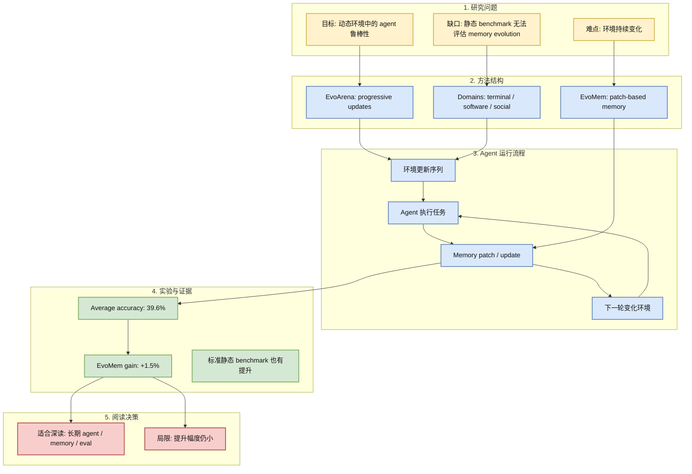
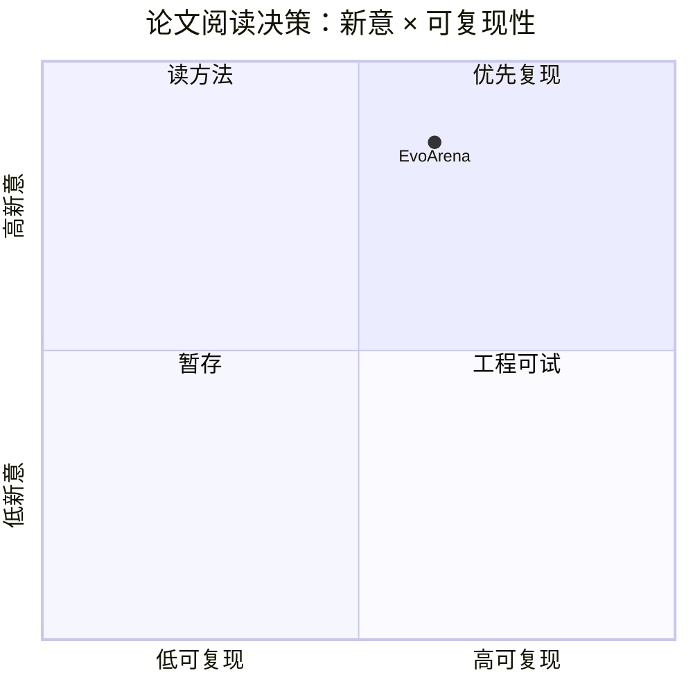

# EvoArena: Tracking Memory Evolution for Robust LLM Agents in Dynamic Environments

> 类型：论文
> 大类：论文
> 小类：Agent Eval / Memory
> 推荐等级：必读
> 创建日期：2026-06-14
> 原文链接：https://arxiv.org/abs/2606.13681v1
> PDF：https://arxiv.org/pdf/2606.13681v1
> 网页详情：https://github.com/dyt27666-oss/AI-news-report-obsidians/blob/main/Papers/Agent-Eval/EvoArena-memory-evolution-llm-agents.md
> 返回日报：[[Daily/2026-06-14]]

## 一句话结论

EvoArena 把 LLM agent 在动态环境中的 memory evolution 变成可测 benchmark，并显示当前 agent 在环境演化场景下平均准确率只有 39.6%。

## TL;DR

- **研究问题**：多数 agent benchmark 假设环境静态，但真实部署中 terminal、software、social preference 都会变化。
- **核心方法**：提出 EvoArena benchmark，并用 EvoMem 记录结构化 patch-based memory evolution。
- **关键结果**：摘要报告当前 agents 在 EvoArena 上平均准确率 39.6%，EvoMem 平均提升 1.5%。
- **对我的价值**：直接命中长期 agent 的记忆演化、环境漂移和鲁棒性评估。
- **建议动作**：读方法和 benchmark 构造，抽取可用于 Hermes/Codex 长任务评测的 schema。

## 论文信息

| 字段 | 内容 |
|---|---|
| 论文来源 | arXiv |
| 来源类型 | 预印本 |
| 标题 | EvoArena: Tracking Memory Evolution for Robust LLM Agents in Dynamic Environments |
| 作者/机构 | Jundong Xu, Qingchuan Li, Jiaying Wu, Yihuai Lan, Shuyue Stella Li, Huichi Zhou, Bowen Jiang, Lei Wang, Jun Wang, Anh Tuan Luu, Caiming Xiong, Hae Won Park, Bryan Hooi, Zhiyuan Hu |
| 发布时间 | 2026-06-11 |
| arXiv | [abs](https://arxiv.org/abs/2606.13681v1) |
| OpenReview / 会议页 | 未发现 |
| Semantic Scholar | https://api.semanticscholar.org/graph/v1/paper/arXiv:2606.13681 |
| PDF | [pdf](https://arxiv.org/pdf/2606.13681v1) |
| 代码 | 未发现 |
| 方向 | Agent Eval / Memory |

## 方法/系统图示

## 专业解读

EvoArena 的核心价值是把“环境会变”纳入 agent benchmark。真实 agent 部署中，软件版本、命令行环境、用户偏好、任务约束都会演化；如果 memory 只是一段静态摘要，很容易把过时信息当成事实。EvoMem 的 patch-based memory 方向值得关注，因为它保留变化历史，而不是只保留最终状态。

## 通俗解释

这篇论文像是在测试一个助理能不能适应“规则每天都变”的工作环境。优秀助理不能只记住旧规则，还要知道哪些规则更新了、为什么更新、现在应该按哪个版本执行。

## 方法拆解

| 组件 | 作用 | 输入 | 输出 | 关键假设 |
|---|---|---|---|---|
| EvoArena | 构造动态任务环境 | progressive updates | 可评分任务序列 | 三个 domain 能代表真实变化 |
| EvoMem | 记录 memory 演化 | 环境变化 / 任务反馈 | structured patches | patch 历史有助于推理 |
| Evaluation | 衡量鲁棒性 | agent 行为 | accuracy / gain | 指标能反映部署鲁棒性 |

## 实验与证据

| 实验 | 说明 | 我怎么看 |
|---|---|---|
| EvoArena 主结果 | 当前 agents 平均准确率 39.6% | 说明动态环境仍是弱点 |
| EvoMem 增益 | 平均 +1.5% | 方向正确但幅度有限，需要看消融 |
| 标准 benchmark | 摘要称也有提升 | 需确认是否有 trade-off |

## 局限性 / 风险

- 摘要级信息不足，需读 PDF 了解任务构造和模型设置。
- +1.5% 提升不大，可能说明 memory patch 只是第一步。
- benchmark domain 是否覆盖真实 agent workflow 仍需验证。

## 对我的影响

| 维度 | 影响 | 建议动作 |
|---|---|---|
| AI Infra | 需要版本化 memory / environment state | 给自动化任务保存变化日志 |
| LLM 工程 | 长上下文摘要不够，需要 patch history | 设计 memory update schema |
| RL / Game AI | 动态环境类似 non-stationary episode | 借鉴 progressive update 评测 |
| Agent / Eval | 强相关 | 加入本周必读 |

## 相关链接

- 原文：https://arxiv.org/abs/2606.13681v1
- PDF：https://arxiv.org/pdf/2606.13681v1
- 网页详情：https://github.com/dyt27666-oss/AI-news-report-obsidians/blob/main/Papers/Agent-Eval/EvoArena-memory-evolution-llm-agents.md
- 代码：未发现
- 相关卡片：[[Daily/2026-06-14]]

## 标签

#ai-radar #paper #agent #memory #eval
