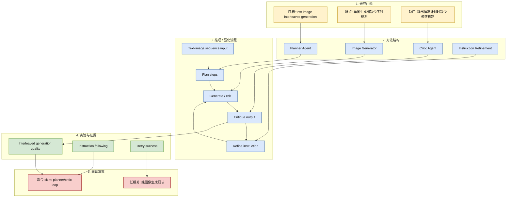
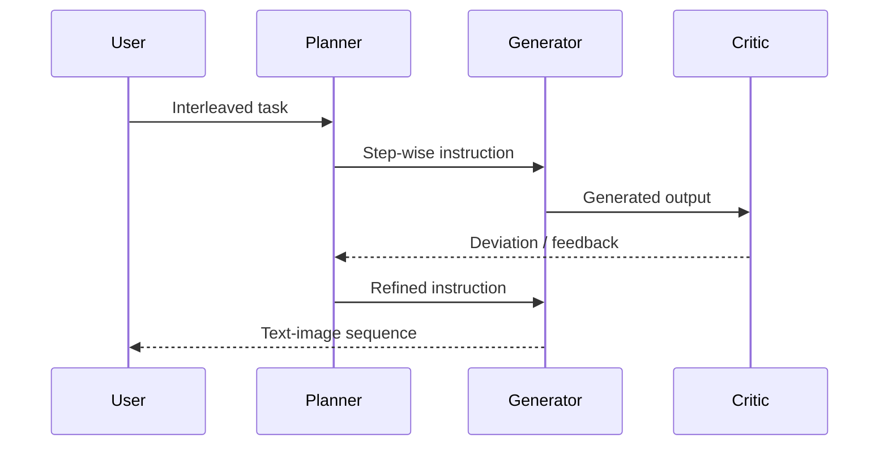

# InterleaveThinker: Reinforcing Agentic Interleaved Generation

> 类型：论文
> 大类：论文
> 小类：Multimodal Agent / RL
> 推荐等级：可 skim
> 创建日期：2026-06-14
> 原文链接：https://arxiv.org/abs/2606.13679v1
> PDF：https://arxiv.org/pdf/2606.13679v1
> 网页详情：https://github.com/dyt27666-oss/AI-news-report-obsidians/blob/main/Papers/Agent-Multimodal/InterleaveThinker-agentic-interleaved-generation.md
> 返回日报：[[Daily/2026-06-14]]

## 一句话结论

InterleaveThinker 用 planner agent 和 critic agent 给现有图像生成器补上 interleaved text-image generation 能力，其 planner/critic/retry loop 对工具型 agent 也有参考价值。

## TL;DR

- **研究问题**：现有图像生成器擅长单图生成/编辑，但难以生成交错的文本-图像序列。
- **核心方法**：planner agent 组织输入序列和步骤，critic agent 评估输出是否偏离计划并触发重生成。
- **关键结果**：摘要称这是面向任意现有 image generator 的 multi-agent pipeline。
- **对我的价值**：虽然偏多模态，但其 agentic planning、critique、retry 机制可迁移到工具调用和仿真任务。
- **建议动作**：skim 方法图，重点看 critic 如何定义偏离和 reward。

## 论文信息

| 字段 | 内容 |
|---|---|
| 论文来源 | arXiv |
| 来源类型 | 预印本 |
| 标题 | InterleaveThinker: Reinforcing Agentic Interleaved Generation |
| 作者/机构 | Dian Zheng, Harry Lee, Manyuan Zhang, Kaituo Feng, Zoey Guo, Ray Zhang, Hongsheng Li |
| 发布时间 | 2026-06-11 |
| arXiv | [abs](https://arxiv.org/abs/2606.13679v1) |
| OpenReview / 会议页 | 未发现 |
| Semantic Scholar | https://api.semanticscholar.org/graph/v1/paper/arXiv:2606.13679 |
| PDF | [pdf](https://arxiv.org/pdf/2606.13679v1) |
| 代码 | 未发现 |
| 方向 | Multimodal Agent / RL |

## 方法/系统图示

## 专业解读

这篇论文对 AI Infra/RL 的价值不在图像生成本身，而在 planner-critic-retry 的系统模式：planner 把复杂任务拆成可执行步骤，critic 定义偏离，retry loop 把失败反馈转成新指令。这与 tool-use agent、game agent 和 embodied manipulation 都有结构相似性。

## 通俗解释

它像让一个“导演”先写分镜，再让“画师”生成画面，最后让“审稿人”检查哪里不符合分镜并要求重画。

## 方法拆解

| 组件 | 作用 | 输入 | 输出 | 关键假设 |
|---|---|---|---|---|
| Planner | 拆解序列任务 | 文本-图像要求 | step plan | 计划能被生成器执行 |
| Generator | 生成图像内容 | step instruction | image/text output | 生成器能力足够强 |
| Critic | 发现偏离 | output + plan | feedback | critic 判断可靠 |
| Retry loop | 修正失败 | feedback | refined instruction | 重试成本可接受 |

## 实验与证据

| 实验 | 说明 | 我怎么看 |
|---|---|---|
| interleaved generation | 验证序列生成能力 | 需看任务复杂度 |
| instruction following | 检查偏离 | critic 质量是核心 |
| retry ablation | 验证反馈闭环 | 对 agent 工程最有参考 |

## 局限性 / 风险

- 偏多模态，与 LLM serving 直接关系弱。
- critic 错误会导致错误重试。
- 若没有代码，复现成本较高。

## 对我的影响

| 维度 | 影响 | 建议动作 |
|---|---|---|
| AI Infra | 需要支持多 agent pipeline | 关注 orchestration 成本 |
| LLM 工程 | planner/critic 可用于工具调用 | 抽象 retry schema |
| RL / Game AI | 可迁移到仿真任务策略修正 | 关注 reward / critic |
| Agent / Eval | 有启发 | skim 方法和消融 |

## 相关链接

- 原文：https://arxiv.org/abs/2606.13679v1
- PDF：https://arxiv.org/pdf/2606.13679v1
- 网页详情：https://github.com/dyt27666-oss/AI-news-report-obsidians/blob/main/Papers/Agent-Multimodal/InterleaveThinker-agentic-interleaved-generation.md
- 代码：未发现
- 相关卡片：[[Daily/2026-06-14]]

## 标签

#ai-radar #paper #agent #multimodal #rl
