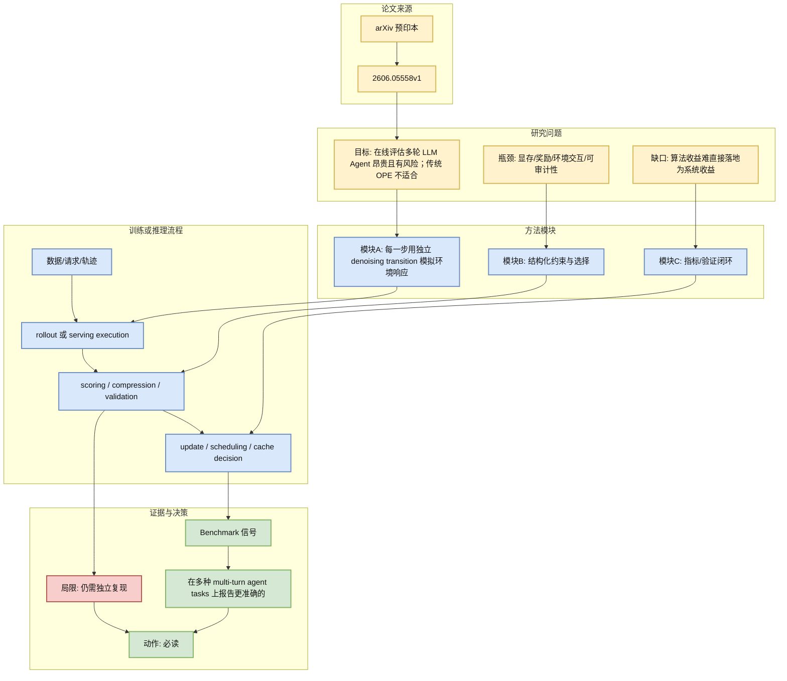
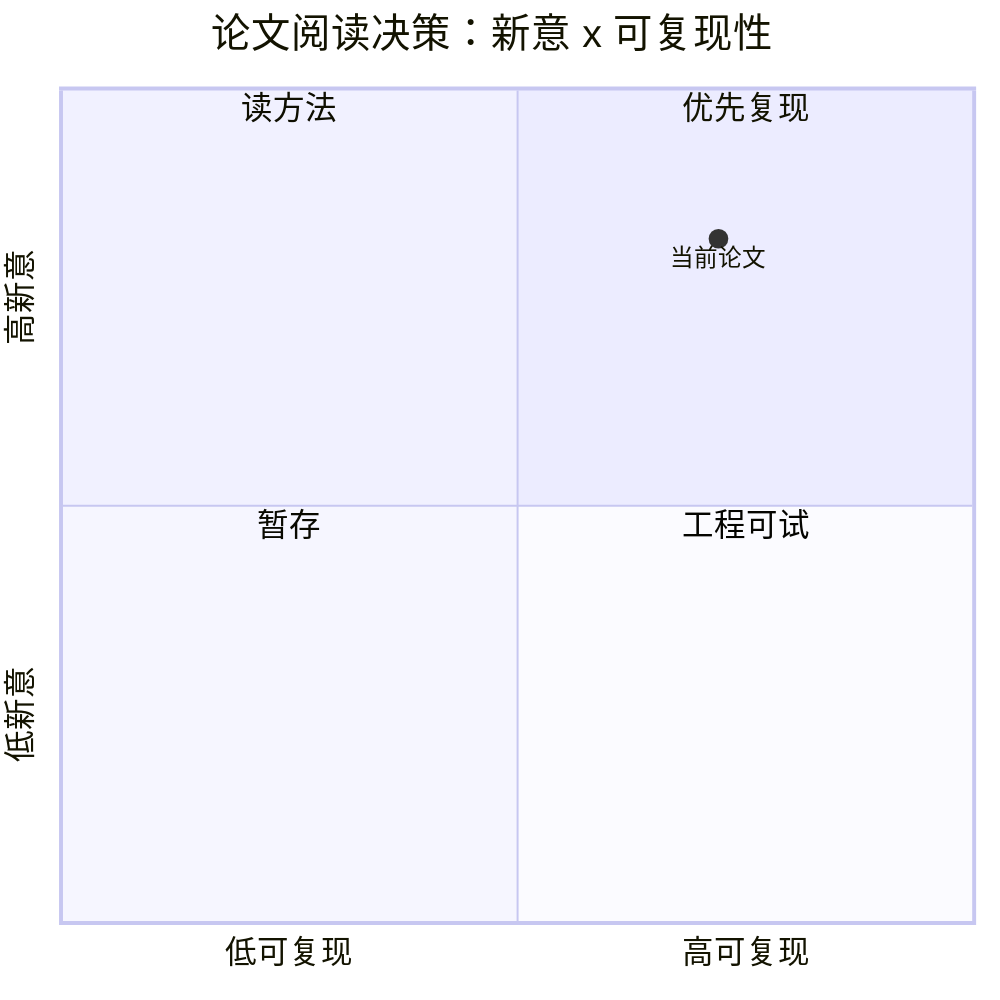

# Autoregressive Diffusion World Models for Off-Policy Evaluation of LLM Agents

> 类型：论文
> 大类：论文
> 小类：Agent Eval / World Model
> 推荐等级：必读
> 创建日期：2026-06-09
> 原文链接：https://arxiv.org/abs/2606.05558v1
> PDF：https://arxiv.org/pdf/2606.05558v1
> 网页详情：https://github.com/dyt27666-oss/AI-news-report-obsidians/blob/main/Papers/Agents/ADWM%20Off-Policy%20Evaluation%20of%20LLM%20Agents.md
> 返回日报：[[Daily/2026-06-09]]

## 一句话结论

ADWM 用自回归 diffusion world model 做 LLM Agent 离线评估，目标是在不真实执行新 policy 的情况下估计多轮交互表现。

## TL;DR

- **研究问题**：在线评估多轮 LLM Agent 昂贵且有风险；传统 OPE 不适合离散文本 action 与环境响应交替出现的场景。
- **核心方法**：每一步用独立 denoising transition 模拟环境响应，并让被评估 policy 通过 score function 条件化 world model。
- **关键结果**：在多种 multi-turn agent tasks 上报告更准确的 value estimates 和 evaluation reliability。
- **对我的价值**：对需要大量 rollout 的 Agent RL 和游戏环境评估很重要，可降低在线环境交互成本。
- **建议动作**：纳入 RL/Agent eval 设计备忘并等代码或复现实验

## 论文信息

| 字段 | 内容 |
|---|---|
| 论文来源 | arXiv |
| 来源类型 | 预印本 |
| 标题 | Autoregressive Diffusion World Models for Off-Policy Evaluation of LLM Agents |
| 作者/机构 | Kaixuan Liu, Guojun Xiong, Weinan Zhang, Shengpu Tang |
| 发布时间 | 2026-06-04 |
| arXiv | [abs](https://arxiv.org/abs/2606.05558v1) |
| OpenReview / 会议页 | 未发现 |
| Semantic Scholar | [arXiv:2606.05558v1](https://www.semanticscholar.org/search?q=2606.05558v1) |
| PDF | [pdf](https://arxiv.org/pdf/2606.05558v1) |
| 代码 | 未发现 |
| 方向 | Agent Eval / World Model |

## 方法/系统图示

### 辅助图：阅读/复现决策矩阵

## 专业解读

Autoregressive Diffusion World Models for Off-Policy Evaluation of LLM Agents 的价值在于把一个已经被大家意识到的瓶颈具体化：在线评估多轮 LLM Agent 昂贵且有风险；传统 OPE 不适合离散文本 action 与环境响应交替出现的场景。 方法层面，作者没有只停留在抽象算法，而是提出了可操作的机制：每一步用独立 denoising transition 模拟环境响应，并让被评估 policy 通过 score function 条件化 world model。 这类工作对用户最相关的点是，它可以直接改变 serving、RL rollout 或 Agent eval 的成本结构。需要注意的是，论文报告的数字来自作者设定的模型、硬件和 benchmark；真正进入内部平台前，必须用自己的模型长度分布、batching 策略、GPU/NPU 后端和评测任务复测。

## 通俗解释

可以把它理解为：原来系统在“记住上下文、探索策略或判断 Agent 是否真的会做事”时有很多浪费，这篇尝试把浪费的位置标出来，并给出更精细的压缩、选择、模拟或审计办法。

## 方法拆解

| 组件 | 作用 | 输入 | 输出 | 关键假设 |
|---|---|---|---|---|
| 问题建模 | 把瓶颈变成可测对象 | workload / rollout / benchmark | 可优化指标 | 指标能代表真实工程痛点 |
| 核心机制 | 执行 每一步用独立 denoising transition  | 模型状态、轨迹或 cache | 更高效的路径 | 额外复杂度不会抵消收益 |
| 验证闭环 | 证明收益不只是局部 trick | baseline 与 ablation | 性能/准确性报告 | benchmark 没有被过拟合 |

## 实验与证据

| 实验 | 说明 | 我怎么看 |
|---|---|---|
| 论文主结果 | 在多种 multi-turn agent tasks 上报告更准确的 value estimates 和 evaluation reliability。 | 有方向价值，但需要按内部任务复现 |
| 消融/系统比较 | 关注是否比较了调度、kernel、baseline 或 judge 泄漏 | 决定它是算法点子还是平台能力 |

## 局限性 / 风险

- 结果依赖作者选择的模型、硬件、benchmark 和实现质量。
- 若没有公开代码或代码尚未成熟，短期只能读方法，不能直接纳入生产。
- 对 serving 论文要特别检查长尾延迟、mixed workload 和多租户调度；对 RL/Agent 论文要检查 reward hacking 与评测污染。

## 对我的影响

| 维度 | 影响 | 建议动作 |
|---|---|---|
| AI Infra | 可能影响 serving/cache/scheduler 或 AgentOps 平台设计 | 做同硬件同模型 microbenchmark |
| LLM 工程 | 影响长上下文、多轮对话、后训练或 eval 成本 | 加入实验 backlog |
| RL / Game AI | credit assignment、world model 或 rollout 效率可迁移 | 用小环境先验证假设 |
| Agent / Eval | 强调可审计、离线评估或环境真实性 | 更新 eval harness checklist |

## 相关链接

- 原文：https://arxiv.org/abs/2606.05558v1
- PDF：https://arxiv.org/pdf/2606.05558v1
- 网页详情：https://github.com/dyt27666-oss/AI-news-report-obsidians/blob/main/Papers/Agents/ADWM%20Off-Policy%20Evaluation%20of%20LLM%20Agents.md
- 代码：未发现
- 相关卡片：[[Daily/2026-06-09]]

## 标签

#ai-radar #paper #agent-eval #world-model #off-policy-evaluation #rl
