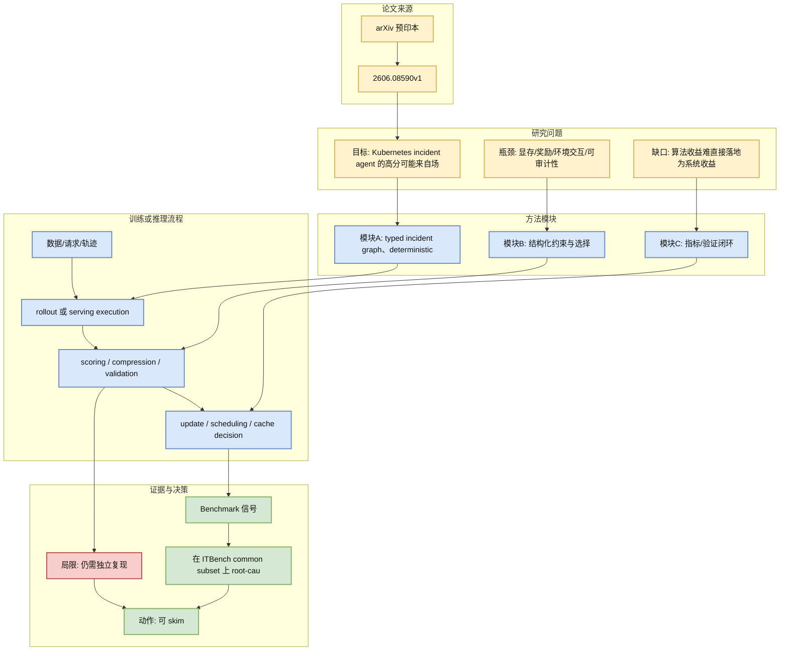
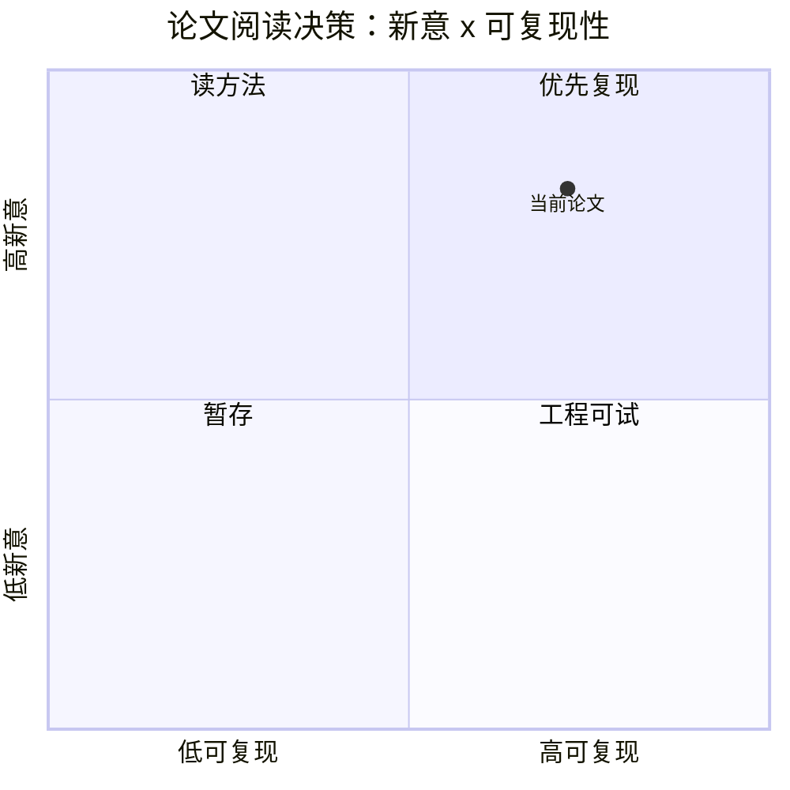

# Auditable Graph-Guided Root Cause Analysis for Kubernetes Incidents

> 类型：论文
> 大类：论文
> 小类：AgentOps / Kubernetes / Eval
> 推荐等级：可 skim
> 创建日期：2026-06-09
> 原文链接：https://arxiv.org/abs/2606.08590v1
> PDF：https://arxiv.org/pdf/2606.08590v1
> 网页详情：https://github.com/dyt27666-oss/AI-news-report-obsidians/blob/main/Papers/Agents/Auditable%20Graph-Guided%20RCA%20for%20Kubernetes%20Incidents.md
> 返回日报：[[Daily/2026-06-09]]

## 一句话结论

这篇把 Kubernetes RCA Agent 放进 typed evidence graph + LangGraph traversal + 独立验证框架，重点是“可审计”，不是只追求 judge 分数。

## TL;DR

- **研究问题**：Kubernetes incident agent 的高分可能来自场景捷径，而非真实证据推理；生产 RCA 需要只读证据、边界、验证和无泄漏。
- **核心方法**：typed incident graph、deterministic graph/tool operations、LangGraph traversal state machine、separate validation stage。
- **关键结果**：在 ITBench common subset 上 root-cause-entity F1 从 0.6087 到 0.9130；去掉场景提示后 19-scenario subset 保留 0.6958 F1。
- **对我的价值**：适合作为内部 AgentOps/RCA eval harness 的设计参考，尤其是 evidence graph 和 verdict validation。
- **建议动作**：纳入 RL/Agent eval 设计备忘并等代码或复现实验

## 论文信息

| 字段 | 内容 |
|---|---|
| 论文来源 | arXiv |
| 来源类型 | 预印本 |
| 标题 | Auditable Graph-Guided Root Cause Analysis for Kubernetes Incidents |
| 作者/机构 | Anastasiia Kuvshinova, Seungmin Jin |
| 发布时间 | 2026-06-07 |
| arXiv | [abs](https://arxiv.org/abs/2606.08590v1) |
| OpenReview / 会议页 | 未发现 |
| Semantic Scholar | [arXiv:2606.08590v1](https://www.semanticscholar.org/search?q=2606.08590v1) |
| PDF | [pdf](https://arxiv.org/pdf/2606.08590v1) |
| 代码 | 未发现 |
| 方向 | AgentOps / Kubernetes / Eval |

## 方法/系统图示

### 辅助图：阅读/复现决策矩阵

## 专业解读

Auditable Graph-Guided Root Cause Analysis for Kubernetes Incidents 的价值在于把一个已经被大家意识到的瓶颈具体化：Kubernetes incident agent 的高分可能来自场景捷径，而非真实证据推理；生产 RCA 需要只读证据、边界、验证和无泄漏。 方法层面，作者没有只停留在抽象算法，而是提出了可操作的机制：typed incident graph、deterministic graph/tool operations、LangGraph traversal state machine、separate validation stage。 这类工作对用户最相关的点是，它可以直接改变 serving、RL rollout 或 Agent eval 的成本结构。需要注意的是，论文报告的数字来自作者设定的模型、硬件和 benchmark；真正进入内部平台前，必须用自己的模型长度分布、batching 策略、GPU/NPU 后端和评测任务复测。

## 通俗解释

可以把它理解为：原来系统在“记住上下文、探索策略或判断 Agent 是否真的会做事”时有很多浪费，这篇尝试把浪费的位置标出来，并给出更精细的压缩、选择、模拟或审计办法。

## 方法拆解

| 组件 | 作用 | 输入 | 输出 | 关键假设 |
|---|---|---|---|---|
| 问题建模 | 把瓶颈变成可测对象 | workload / rollout / benchmark | 可优化指标 | 指标能代表真实工程痛点 |
| 核心机制 | 执行 typed incident graph、determi | 模型状态、轨迹或 cache | 更高效的路径 | 额外复杂度不会抵消收益 |
| 验证闭环 | 证明收益不只是局部 trick | baseline 与 ablation | 性能/准确性报告 | benchmark 没有被过拟合 |

## 实验与证据

| 实验 | 说明 | 我怎么看 |
|---|---|---|
| 论文主结果 | 在 ITBench common subset 上 root-cause-entity F1 从 0.6087 到 0.9130；去掉场景提示后 19-scenario subset 保留 0.6958 F1。 | 有方向价值，但需要按内部任务复现 |
| 消融/系统比较 | 关注是否比较了调度、kernel、baseline 或 judge 泄漏 | 决定它是算法点子还是平台能力 |

## 局限性 / 风险

- 结果依赖作者选择的模型、硬件、benchmark 和实现质量。
- 若没有公开代码或代码尚未成熟，短期只能读方法，不能直接纳入生产。
- 对 serving 论文要特别检查长尾延迟、mixed workload 和多租户调度；对 RL/Agent 论文要检查 reward hacking 与评测污染。

## 对我的影响

| 维度 | 影响 | 建议动作 |
|---|---|---|
| AI Infra | 可能影响 serving/cache/scheduler 或 AgentOps 平台设计 | 做同硬件同模型 microbenchmark |
| LLM 工程 | 影响长上下文、多轮对话、后训练或 eval 成本 | 加入实验 backlog |
| RL / Game AI | credit assignment、world model 或 rollout 效率可迁移 | 用小环境先验证假设 |
| Agent / Eval | 强调可审计、离线评估或环境真实性 | 更新 eval harness checklist |

## 相关链接

- 原文：https://arxiv.org/abs/2606.08590v1
- PDF：https://arxiv.org/pdf/2606.08590v1
- 网页详情：https://github.com/dyt27666-oss/AI-news-report-obsidians/blob/main/Papers/Agents/Auditable%20Graph-Guided%20RCA%20for%20Kubernetes%20Incidents.md
- 代码：未发现
- 相关卡片：[[Daily/2026-06-09]]

## 标签

#ai-radar #paper #agentops #kubernetes #eval #rca
