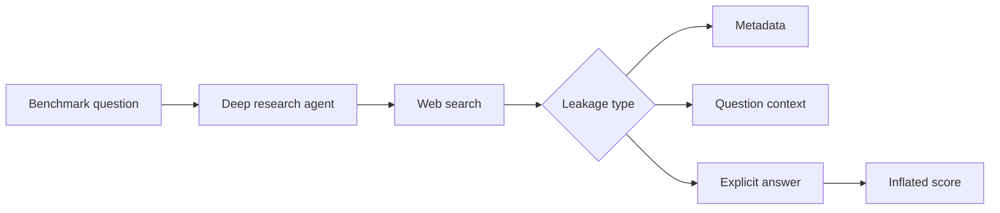

# Search-Time Contamination in Deep Research Agents

> 类型：论文
> 分类：Agent Evaluation / Deep Research
> 推荐等级：必读
> 创建日期：2026-06-08
> 原文链接：https://arxiv.org/abs/2606.05241v1

## 一句话结论

联网 deep research agent 可能在推理时搜到 benchmark 元数据、题面上下文甚至答案，从而虚高评测结果。

## 论文信息

- 标题：Search-Time Contamination in Deep Research Agents: Measuring Performance Inflation in Public Benchmark Evaluation
- 作者/机构：Yongjie Wang, Xinyue Zhang, Kunhong Yao, Zhiwei Zeng
- 发布时间：2026-06-03
- arXiv：https://arxiv.org/abs/2606.05241v1
- PDF：https://arxiv.org/pdf/2606.05241v1
- 代码：未在 arXiv 元数据中确认

## 专业解读

这篇论文抓住了 deep research agent 的核心评测漏洞：传统 benchmark 的闭卷假设被 web search 打破。它把污染分成 Benchmark Metadata Leakage、Question-Context Leakage、Explicit Answer Leakage，并设计检测算法量化性能膨胀。对 Agent 平台来说，这意味着 eval 时必须控制 search scope、缓存快照、日志审计和答案泄漏检测。

## 通俗解释

给会联网搜索的 Agent 做考试时，它可能直接搜到答案。论文研究如何发现这种考试时污染。

## 方法图示

## 解决什么问题

公共 benchmark 在联网 Agent 推理时会被检索污染，导致性能虚高。

## 核心方法

- 定义三类 search-time contamination。
- 设计检测算法识别检索结果中的泄漏。
- 在多个公共 benchmark 和 deep research agent 上量化影响。

## 和已有工作的差异

相比训练数据污染，它关注 inference/search 阶段的动态污染；这是 Agent 评测特有问题。

## 实验与证据

摘要称评估现代 deep research agents 在六个公共 benchmark 上的污染影响；具体模型和数值需读 PDF。

## 局限性

- 检测算法可能漏掉语义改写后的答案泄漏。
- 封闭搜索环境会牺牲真实产品场景。

## 对我的影响

- AI Infra：Agent eval 需要可控搜索代理和检索日志。
- LLM 工程：公开 benchmark 分数要标注是否联网。
- RL / Game AI：在线环境信息泄漏也会虚高策略评估。
- 建议动作：必读，更新 Agent eval protocol。

## 标签

#ai-radar #paper #agent #evaluation #deep-research #contamination
