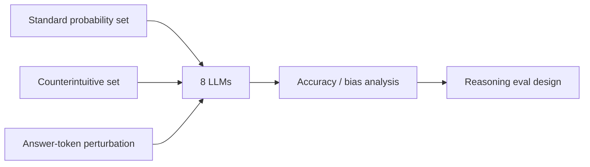

# How reliable are LLMs when it comes to playing dice?

> 类型：论文
> 分类：LLM Evaluation / Reasoning
> 推荐等级：可 skim
> 创建日期：2026-06-08
> 原文链接：https://arxiv.org/abs/2606.07515v1

## 一句话结论

8 个 SOTA 模型在标准离散概率题上平均 0.96，但在反直觉题上降到 0.59，并出现 token bias。

## 论文信息

- 标题：How reliable are LLMs when it comes to playing dice?
- 作者/机构：Luca Avena, Gianmarco Bet, Bernardo Busoni
- 发布时间：2026-06-05
- arXiv：https://arxiv.org/abs/2606.07515v1
- PDF：https://arxiv.org/pdf/2606.07515v1
- 代码：未在 arXiv 元数据中确认

## 专业解读

这篇论文虽不是 infra，但对 reasoning eval 有价值：它构造标准题与反直觉题，显示 CoT 不能消除启发式偏差，并报告候选答案 token 改变可带来超过 20% 的性能下降。对评测工程来说，这提示 benchmark 不能只看题目语义，还要控制选项 token、表述顺序、反直觉分布。

## 通俗解释

模型会做普通概率题，但遇到容易误导人的题就明显变差；甚至答案选项的文字形式也会影响结果。

## 方法图示

## 解决什么问题

评估 LLM 离散概率推理是否稳健，尤其在反直觉问题和 token bias 下。

## 核心方法

- 构造标准练习题和反直觉题两个数据集。
- 测试 8 个模型，比较有/无 CoT。
- 分析候选答案 token bias。

## 和已有工作的差异

相比普通数学 benchmark，它专门诱发认知偏差并测量 token 表述影响。

## 实验与证据

摘要给出标准题 0.96、反直觉题 0.59，以及 token bias 超过 20% drop。

## 局限性

- 任务范围集中在离散概率。
- 是否代表真实复杂推理仍需更多 benchmark。

## 对我的影响

- AI Infra：eval 数据生成要控制格式偏差。
- LLM 工程：reasoning benchmark 需加入反直觉和选项扰动测试。
- RL / Game AI：概率推理偏差会影响策略规划和风险判断。
- 建议动作：可 skim，用于扩展 eval suite。

## 标签

#ai-radar #paper #eval #reasoning #probability
