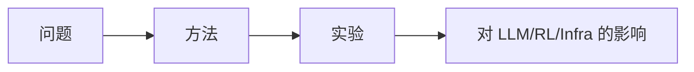

# Your UnEmbedding Matrix is Secretly a Feature Lens for Text Embeddings

> 类型：论文
> 分类：LLM Inference / Serving
> 推荐等级：必读
> 原文链接：https://arxiv.org/abs/2606.07502v1

## 论文信息
- 作者：Songhao Wu, Zhongxin Chen, Yuxuan Liu, Heng Cui, Cong Li
- 发布时间：2026-06-05
- PDF：https://arxiv.org/pdf/2606.07502v1
- 分类：cs.CL, cs.IR

## 专业解读
摘要要点：Large language models exhibit impressive zero-shot capabilities across a wide range of downstream tasks. However, they struggle to function as off-the-shelf embedding models, leading to suboptimal performance on massive text embedding benchmarks. In this paper, we identify a potential cause underlying this deficiency. Our motivation stems from an unexpected observation: text embeddings tend to align with frequent but uninformative tokens when projected onto the vocabulary space. We argue that this excessive expression of high-frequency tokens suppresses the model's ability to capture nuanced semantics. To address this, we introduce EmbedFilter, a simple linear transformation designed to refine text embeddings derived from LLMs directly. Specifically, we uncover that the unembedding matrix within LLMs encodes a latent space that is actively writing these frequent tokens into embedding spa

工程上重点判断它是否能转化为训练、推理、评估或 agent 系统中的可复现改进。

## 通俗解释
这篇论文是在尝试改进 AI 系统的一项关键能力。先看图、实验表和限制，再决定是否深读。

## 方法图示

## 相关链接
- 原文：https://arxiv.org/abs/2606.07502v1
- PDF：https://arxiv.org/pdf/2606.07502v1

#ai-radar #paper
