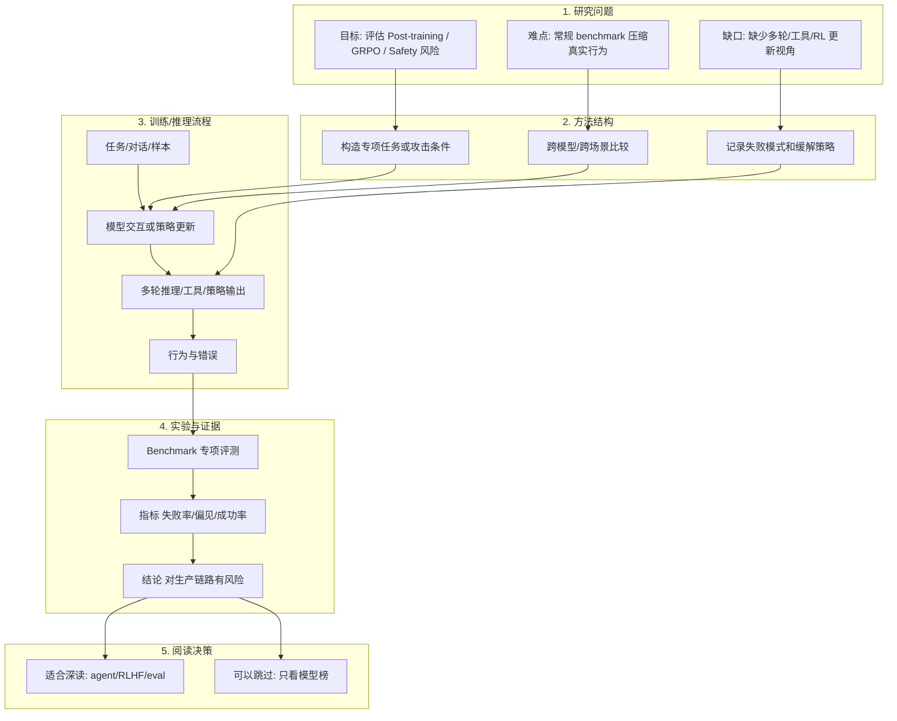
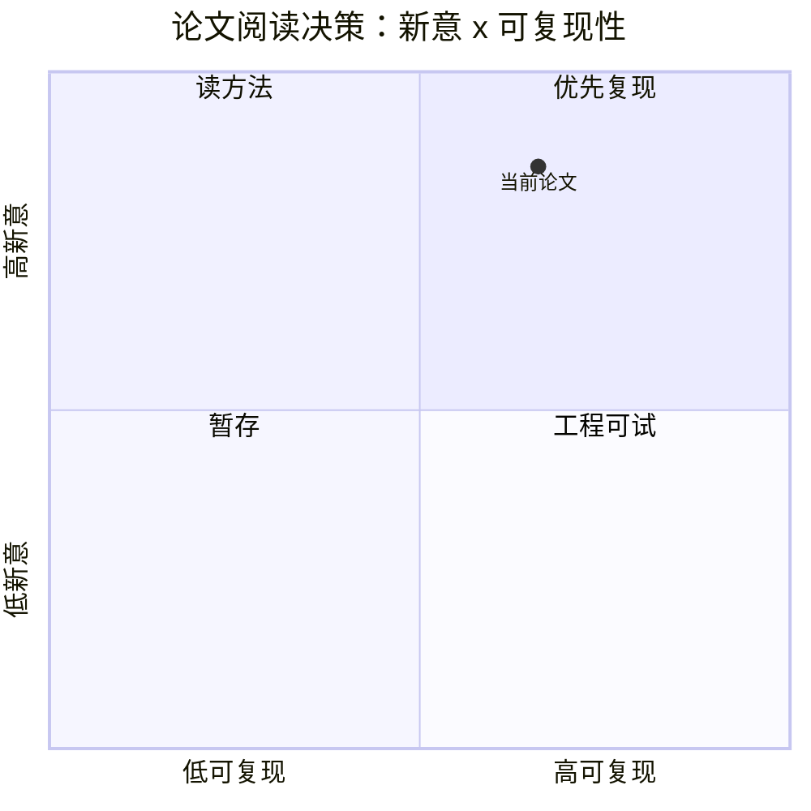

# It Takes One to Bias Them All: Breaking Bad with One-Shot GRPO

> 类型：论文
> 大类：论文
> 小类：Post-training / GRPO / Safety
> 推荐等级：必读
> 创建日期：2026-06-10
> 原文链接：https://arxiv.org/abs/2606.10931v1
> PDF：https://arxiv.org/pdf/2606.10931v1
> 网页详情：https://github.com/dyt27666-oss/AI-news-report-obsidians/blob/main/Papers/Post-training%20-%20GRPO%20-%20Safety/2026-06-10-2606.10931v1-It-Takes-One-to-Bias-Them-All-Breaking-Bad-with-One-Shot-GRPO.md
> 返回日报：[[Daily/2026-06-10]]

## 一句话结论

单个有偏样本就可能通过 one-shot GRPO 诱导系统性偏见。

## TL;DR

- **研究问题**：Post-training / GRPO / Safety 中的可靠性、泛化或安全问题。
- **核心方法**：构造专项评测/攻击或 agent 任务协议，观察模型在多轮、工具、RL 更新下的行为变化。
- **关键结果**：单个有偏样本就可能通过 one-shot GRPO 诱导系统性偏见。
- **对我的价值**：RLHF/GRPO 后训练需要更强的数据门禁、小批次更新审计和安全回归。
- **建议动作**：先读摘要和实验设置，再决定是否复现到内部评测集。

## 论文信息

| 字段 | 内容 |
|---|---|
| 论文来源 | arXiv |
| 来源类型 | 预印本 |
| 标题 | It Takes One to Bias Them All: Breaking Bad with One-Shot GRPO |
| 作者/机构 | Naihao Deng, Yilun Zhu, Naichen Shi, Clayton Scott |
| 发布时间 | 2026-06-09 |
| arXiv | [abs](https://arxiv.org/abs/2606.10931v1) |
| OpenReview / 会议页 | 未发现 |
| Semantic Scholar | 未查询 |
| PDF | [pdf](https://arxiv.org/pdf/2606.10931v1) |
| 代码 | 未发现 |
| 方向 | Post-training / GRPO / Safety |

## 方法/系统图示

## 专业解读

这篇论文把问题从模型平均能力转到系统化失败模式。RLHF/GRPO 后训练需要更强的数据门禁、小批次更新审计和安全回归。 对生产系统来说，真正危险的是错误在多轮状态、memory、工具调用或 RL 更新中被放大，而不是单次回答的错误。建议重点读实验 protocol、数据构造方式、失败案例分类和缓解策略。

## 通俗解释

它不是在问模型会不会做题，而是在问模型在长期使用、被记忆影响、被坏样本训练或遇到陌生任务时，会不会形成错误习惯并继续放大。

## 方法拆解

| 组件 | 作用 | 输入 | 输出 | 关键假设 |
|---|---|---|---|---|
| 专项任务集 | 暴露隐藏失败模式 | 多轮/工具/训练样本 | 失败样本 | 任务能代表真实风险 |
| 跨模型比较 | 区分模型能力与系统问题 | 多模型输出 | 差异分析 | 评测设置公平 |
| 缓解建议 | 给工程落地路径 | 错误模式 | 过滤/评测/约束 | 可接入现有流水线 |

## 实验与证据

| 实验 | 说明 | 我怎么看 |
|---|---|---|
| 多条件评测 | 比较 baseline 与风险条件 | 适合改造成 CI 回归 |
| 失败模式分析 | 解释错误如何发生 | 比单一分数更有工程价值 |

## 局限性 / 风险

- 预印本，结论需等待同行评议或复现。
- 是否覆盖真实生产工作负载仍需验证。
- 代码未发现，复现成本可能偏高。

## 对我的影响

| 维度 | 影响 | 建议动作 |
|---|---|---|
| AI Infra | 需要把状态和评测纳入基础设施 | 加入 trace-level 评估 |
| LLM 工程 | 后训练/agent 行为可能被小信号放大 | 增加 safety regression |
| RL / Game AI | 训练样本和 reward 偏差可能快速泛化 | 检查 reward hacking 用例 |
| Agent / Eval | 强相关 | 抽取 benchmark 设计思路 |

## 相关链接

- 原文：https://arxiv.org/abs/2606.10931v1
- PDF：https://arxiv.org/pdf/2606.10931v1
- 网页详情：https://github.com/dyt27666-oss/AI-news-report-obsidians/blob/main/Papers/Post-training%20-%20GRPO%20-%20Safety/2026-06-10-2606.10931v1-It-Takes-One-to-Bias-Them-All-Breaking-Bad-with-One-Shot-GRPO.md
- 代码：未发现
- 相关卡片：[[Daily/2026-06-10]]

## 标签

#ai-radar #paper #llm #agent #eval #rlhf
