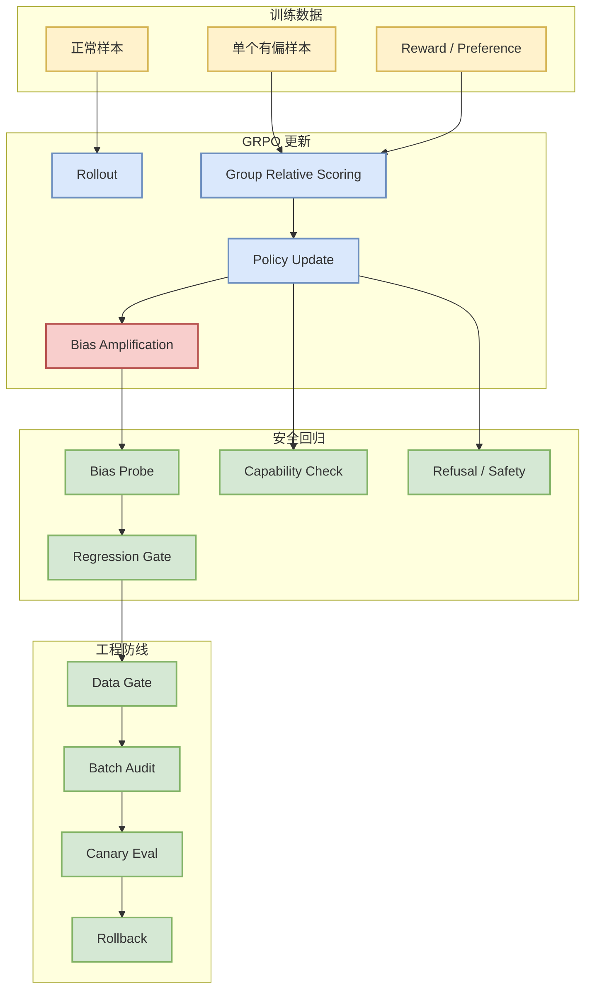
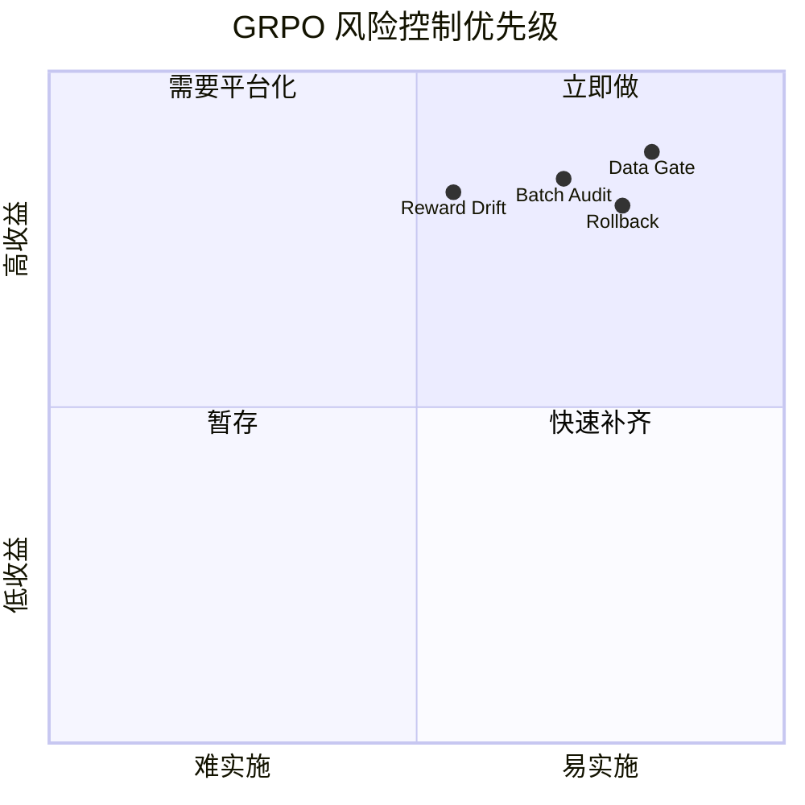

# It Takes One to Bias Them All: Breaking Bad with One-Shot GRPO

> 类型：论文  
> 大类：Papers  
> 小类：Post-training / GRPO / Safety  
> 推荐等级：必读  
> 创建日期：2026-06-11  
> 原文链接：https://arxiv.org/abs/2606.10931v1  
> PDF：https://arxiv.org/pdf/2606.10931v1  
> 返回日报：[[Daily/2026-06-11]]

## 一句话结论

如果 one-shot GRPO 的结论成立，后训练安全不能只依赖大规模平均效果，必须审计小批次样本、reward 信号和更新前后的安全回归。

## TL;DR

- **它是什么**：arXiv 预印本，研究单个有偏样本对 GRPO 后训练的系统性影响。
- **为什么重要**：GRPO/RLHF 常被用于 reasoning/post-training，一旦小样本污染可放大，训练平台需要更强数据门禁。
- **和我相关的点**：对 RL 游戏模型训练、LLM post-training、agent policy fine-tune 都是安全提示。
- **建议动作**：检查数据过滤、batch 审计、reward model drift 和安全回归。

## 元信息

| 字段 | 内容 |
|---|---|
| 论文来源 | arXiv |
| 来源类型 | 预印本 |
| 作者/机构 | Naihao Deng et al. |
| 发布时间 | 2026-06-10 |
| abs | https://arxiv.org/abs/2606.10931v1 |
| PDF | https://arxiv.org/pdf/2606.10931v1 |
| 代码 | 未发现 |

## 信息压缩图示

## 专业解读

GRPO 在 reasoning/post-training 中热度很高，但这篇论文提醒我们：RL 更新不是普通监督学习的简单平均，reward 和 group-relative scoring 可能把局部异常样本放大为策略偏移。即使最终能力指标上升，也可能引入偏见、安全边界退化或特定行为模式污染。

工程上，post-training pipeline 应该记录每批样本、reward 分布、更新前后 safety eval、模型差异和可回滚 artifact。尤其是小规模快速实验，如果缺少 canary eval，很容易把局部优化误判为全局收益。

## 通俗解释

这就像训练时混入一条“坏示范”，模型不只是记住这条坏示范，还可能把它当成更普遍的规则。

## 关键机制拆解

| 机制 | 解决的问题 | 为什么有效 | 可能的坑 |
|---|---|---|---|
| Group relative scoring | 降低绝对 reward 标定难度 | 适合比较式优化 | 小组内异常样本影响大 |
| One-shot bias | 暴露小样本脆弱性 | 能测试安全边界 | 需确认是否普遍泛化 |
| Safety regression | 捕获更新副作用 | 发布前��断坏模型 | 评测集需持续更新 |

## 对我的影响

| 维度 | 影响 | 建议动作 |
|---|---|---|
| AI Infra | 训练平台要记录 batch 和 reward artifact | 增加 batch-level audit |
| LLM 工程 | post-training 需安全回归 | 增加 canary eval |
| RL / Game AI | reward 污染会影响策略 | 检查环境和奖励异常 |
| Agent / Eval | agent policy 微调需防偏置 | 保留上线前评测门禁 |

## 可信度与局限性

- 证据强度：中；arXiv 预印本，需读全文确认实验规模。
- 局限性：不同模型、任务和 GRPO 实现的泛化性待验证。
- 还需要确认：是否有代码、数据、baseline 和消融实验。

## 我应该如何跟进

1. 阅读实验设置，确认 one-shot 条件和 bias 指标。
2. 在内部 post-training pipeline 加入样本影响审计。
3. 对 GRPO 实验加入更新前后 safety/capability canary。

## 相关链接

- arXiv：https://arxiv.org/abs/2606.10931v1
- PDF：https://arxiv.org/pdf/2606.10931v1
- 返回日报：[[Daily/2026-06-11]]

## 标签

#ai-radar #arxiv #grpo #post-training #rlhf #safety
