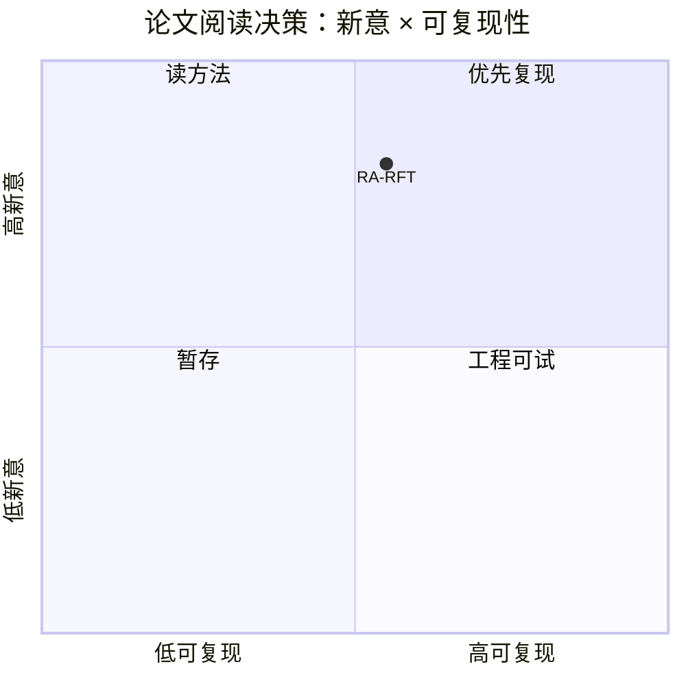

# Learning to Reason by Analogy via Retrieval-Augmented Reinforcement Fine-Tuning

> 类型：论文
> 大类：论文
> 小类：Post-training / RAG / RL
> 推荐等级：必读
> 创建日期：2026-06-14
> 原文链接：https://arxiv.org/abs/2606.13680v1
> PDF：https://arxiv.org/pdf/2606.13680v1
> 网页详情：https://github.com/dyt27666-oss/AI-news-report-obsidians/blob/main/Papers/Post-training/RA-RFT-reasoning-by-analogy.md
> 返回日报：[[Daily/2026-06-14]]

## 一句话结论

RA-RFT 把 retrieval 从语义相似推进到 reasoning benefit，相当于为强化微调提供“解题思路相似”的类比示例。

## TL;DR

- **研究问题**：传统 RAG 按语义相似检索，但复杂推理需要的是解法模式相似。
- **核心方法**：gold-relevance distillation 训练 retriever，再用 reinforcement fine-tuning 让 policy 利用类比 demonstrations。
- **关键结果**：摘要称 reasoning-aware retrieval 能发现表面不同但推理结构相近的上下文。
- **对我的价值**：适合 post-training、代码/数学 reasoning、agent planning 数据管线。
- **建议动作**：读 reward、retriever 训练和 RFT 设置。

## 论文信息

| 字段 | 内容 |
|---|---|
| 论文来源 | arXiv |
| 来源类型 | 预印本 |
| 标题 | Learning to Reason by Analogy via Retrieval-Augmented Reinforcement Fine-Tuning |
| 作者/机构 | Zilin Xiao, Qi Ma, Chun-cheng Jason Chen, Xintao Chen, Avinash Atreya, Hanjie Chen, Vicente Ordonez |
| 发布时间 | 2026-06-11 |
| arXiv | [abs](https://arxiv.org/abs/2606.13680v1) |
| OpenReview / 会议页 | 未发现 |
| Semantic Scholar | https://api.semanticscholar.org/graph/v1/paper/arXiv:2606.13680 |
| PDF | [pdf](https://arxiv.org/pdf/2606.13680v1) |
| 代码 | 未发现 |
| 方向 | Post-training / RAG / RL |

## 方法/系统图示

```mermaid
flowchart TB
  subgraph Q[1. 研究问题]
    Q1[目标: 通过类比提升推理]
    Q2[难点: 语义相似不等于解法相似]
    Q3[缺口: 检索器不知道上下文的推理收益]
  end
  subgraph M[2. 方法结构]
    M1[Gold-relevance distillation]
    M2[Reasoning-benefit retriever]
    M3[Reinforcement fine-tuning]
  end
  subgraph Pipeline[3. 训练流程]
    D[问题 / 候选 demonstrations] --> R[Retriever ranking]
    R --> C[Analogous contexts]
    C --> P[Policy rollout]
    P --> V[Verifiable reward]
    V --> U[Policy update]
  end
  subgraph Eval[4. 实验与证据]
    E1[Reasoning tasks]
    E2[Diversity of retrieved contexts]
    E3[Outcome reward]
  end
  subgraph Read[5. 阅读决策]
    X1[适合深读: RAG + RL + post-training]
    X2[风险: 训练成本和数据依赖]
  end
  Q1 --> M1
  Q2 --> M2
  Q3 --> M3
  M1 --> R
  M2 --> C
  M3 --> P
  U --> E1
  E1 --> E2 --> X1
  E3 --> X2
  classDef problem fill:#fff2cc,stroke:#d6b656,stroke-width:2px,color:#111;
  classDef method fill:#dae8fc,stroke:#6c8ebf,stroke-width:2px,color:#111;
  classDef eval fill:#d5e8d4,stroke:#82b366,stroke-width:2px,color:#111;
  classDef decision fill:#f8cecc,stroke:#b85450,stroke-width:2px,color:#111;
  class Q1,Q2,Q3 problem;
  class M1,M2,M3,D,R,C,P,V,U method;
  class E1,E2,E3 eval;
  class X1,X2 decision;
```

## 专业解读

RA-RFT 的关键思想是把 retrieval 变成 post-training 的一部分。传统 RAG 找“看起来像”的材料，但推理任务真正需要的是“解法结构像”的材料；这更接近示例选择、curriculum 和 reward design 的结合。对 LLM 工程来说，它提示我们��构造 SFT/RL 数据时，不应只按 embedding 相似度取样，而要估计示例对最终 reward 的边际贡献。

## 通俗解释

做题时，最有帮助的参考题不一定题面最像，而是解法套路最像。RA-RFT 就是在训练模型学会找这种“套路相似”的例子。

## 方法拆解

| 组件 | 作用 | 输入 | 输出 | 关键假设 |
|---|---|---|---|---|
| Gold-relevance distillation | 训练 retriever | 问题和候选示例 | reasoning benefit 排名 | gold relevance 可构造 |
| Retriever | 找类比上下文 | 当前问题 | demonstrations | 类比示例能提升 policy |
| RFT | 用 reward 更新模型 | rollout / reward | policy update | reward 可验证且不易被 hack |

## 实验与证据

| 实验 | 说明 | 我怎么看 |
|---|---|---|
| reasoning tasks | 验证复杂推理表现 | 需看任务是否覆盖代码/数学 |
| retrieved diversity | 分析检索上下文多样性 | 关键是是否真抓到推理结构 |
| reward improvement | 用 outcome reward 训练 | 需关注 reward hacking |

## 局限性 / 风险

- retriever 训练需要高质量 relevance 信号。
- RFT 成本和稳定性取决于 reward 设计。
- 如果 demonstration 质量不稳定，可能引入错误推理模式。

## 对我的影响

| 维度 | 影响 | 建议动作 |
|---|---|---|
| AI Infra | 需要支持检索器和 policy 联训流水线 | 记录数据/训练依赖 |
| LLM 工程 | 影响 RAG 和 post-training 数据构造 | 关注 retriever objective |
| RL / Game AI | 类比检索可用于策略学习样例选择 | 尝试迁移到任务 replay |
| Agent / Eval | 可用于 planner 示例检索 | 看是否能结合 agent benchmark |

## 相关链接

- 原文：https://arxiv.org/abs/2606.13680v1
- PDF：https://arxiv.org/pdf/2606.13680v1
- 网页详情：https://github.com/dyt27666-oss/AI-news-report-obsidians/blob/main/Papers/Post-training/RA-RFT-reasoning-by-analogy.md
- 代码：未发现
- 相关卡片：[[Daily/2026-06-14]]

## 标签

#ai-radar #paper #post-training #rag #rl
