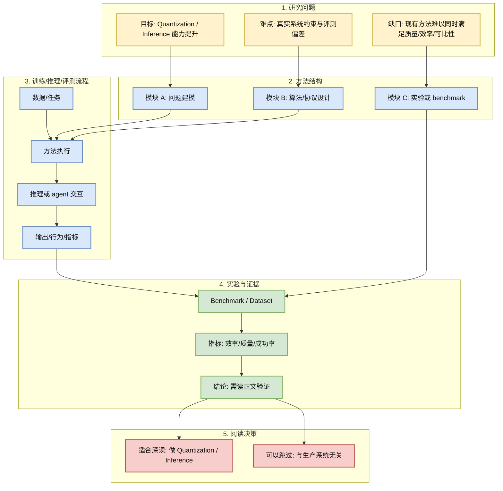
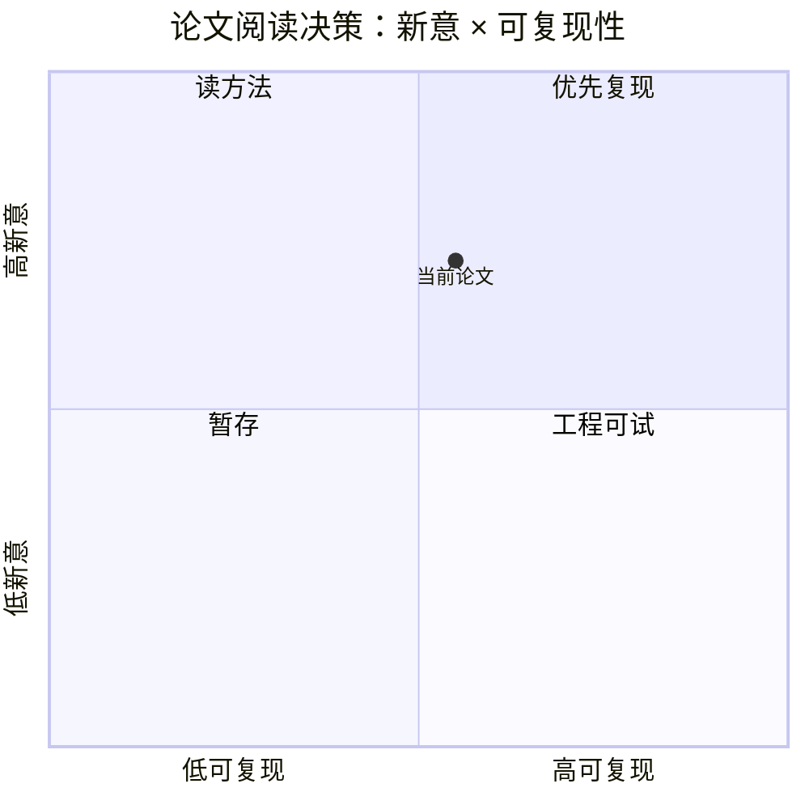

# TWLA: Achieving Ternary Weights and Low-Bit Activations for LLMs via Post-Training Quantization

> 类型：论文
> 大类：论文
> 小类：Quantization / Inference
> 推荐等级：可 skim
> 创建日期：2026-06-13
> 原文链接：https://arxiv.org/abs/2606.13054v1
> PDF：https://arxiv.org/pdf/2606.13054v1
> 网页详情：https://github.com/dyt27666-oss/AI-news-report-obsidians/blob/main/Papers/Quantization/TWLA_ternary_lowbit_activations_LLM_2026_06_13.md
> 返回日报：[[Daily/2026-06-13]]

## 一句话结论

TWLA 面向 LLM post-training quantization，把 ternary weights 与 low-bit activations 结合，试图解决 activation heavy-tail 导致端到端低比特推理难落地的问题。

## TL;DR

- **研究问题**：TWLA 面向 LLM post-training quantization，把 ternary weights 与 low-bit activations 结合，试图解决 activation heavy-tail 导致端到端低比特推理难落地的问题。
- **核心方法**：围绕 Quantization / Inference 的方法/benchmark/系统结构改进。
- **关键结果**：摘要显示其目标是提升可靠性、可比性或推理部署效率；需读正文确认实验强度。
- **对我的价值**：如果激活也能低比特化，收益不只是模型大小，而是 kernel、带宽、吞吐和边缘/异构硬件部署。
- **建议动作**：先读方法图和实验设置，若有代码再决定是否复现。

## 论文信息

| 字段 | 内容 |
|---|---|
| 论文来源 | arXiv |
| 来源类型 | 预印本 |
| 标题 | TWLA: Achieving Ternary Weights and Low-Bit Activations for LLMs via Post-Training Quantization |
| 作者/机构 | Zhixiong Zhao, Zukang Xu, Zhixuan Chen, Xing Hu, Zhe Jiang |
| 发布时间 | 2026-06-11 |
| arXiv | [abs](https://arxiv.org/abs/2606.13054v1) |
| OpenReview / 会议页 | 未发现 |
| Semantic Scholar | 未查询 |
| PDF | [pdf](https://arxiv.org/pdf/2606.13054v1) |
| 代码 | 未发现 |
| 方向 | Quantization / Inference |

## 方法/系统图示

### 辅助图：阅读/复现决策矩阵

## 专业解读

如果激活也能低比特化，收益不只是模型大小，而是 kernel、带宽、吞吐和边缘/异构硬件部署。 这篇论文应优先关注其问题定义是否贴近真实 workload：例如 quantization 是否覆盖 activation/kernel 端到端收益，agent eval 是否有固定 runtime budget 和 workspace contract，coding agent exploration 是否能解释多文件修改的失败模式。不要只看标题和摘要，应进一步检查 benchmark 规模、baseline、消融和是否开源。

## 通俗解释

这类论文的核心价值是把“模型能不能做”变成“在真实工程约束下能不能稳定、便宜、可复现地做”。如果方法能被转成脚本、benchmark 或服务组件，就值得加入长期观察。

## 方法拆解

| 组件 | 作用 | 输入 | 输出 | 关键假设 |
|---|---|---|---|---|
| 问题建模 | 明确要优化的失败模式 | 任务/模型/环境 | 可测指标 | 指标能代表真实场景 |
| 方法模块 | 提供算法或协议改进 | 数据/上下文/模型 | 推理或评测结果 | baseline 公平 |
| 实验模块 | 验证收益和局限 | benchmark | 成功率/效率/质量 | 数据无泄漏且可复现 |

## 实验与证据

| 实验 | 说明 | 我怎么看 |
|---|---|---|
| 主 benchmark | 摘要提及的核心评测 | 需要检查规模和 baseline |
| 消融/效率 | 判断改进来自哪里 | 如果缺失则只作趋势观察 |

## 局限性 / 风险

- 仅基于摘要筛选，实验细节仍需正文确认。
- 未发现代码，短期复现成本可能偏高。
- 若 benchmark 与真实 agent/serving workload 偏离，工程价值会下降。

## 对我的影响

| 维度 | 影响 | 建议动作 |
|---|---|---|
| AI Infra | 可转化为性能/评测 checklist | 读实验设置 |
| LLM 工程 | 关注质量、成本和可靠性 | 记录指标定义 |
| RL / Game AI | 若涉及闭环/agent，可迁移到环境评测 | 暂列观察 |
| Agent / Eval | 对 harness 和 benchmark 很有参考 | 跟踪代码发布 |

## 相关链接

- 原文：https://arxiv.org/abs/2606.13054v1
- PDF：https://arxiv.org/pdf/2606.13054v1
- 网页详情：https://github.com/dyt27666-oss/AI-news-report-obsidians/blob/main/Papers/Quantization/TWLA_ternary_lowbit_activations_LLM_2026_06_13.md
- 代码：未发现
- 相关卡片：[[Daily/2026-06-13]]

## 标签

#ai-radar #paper #agent #eval #serving
