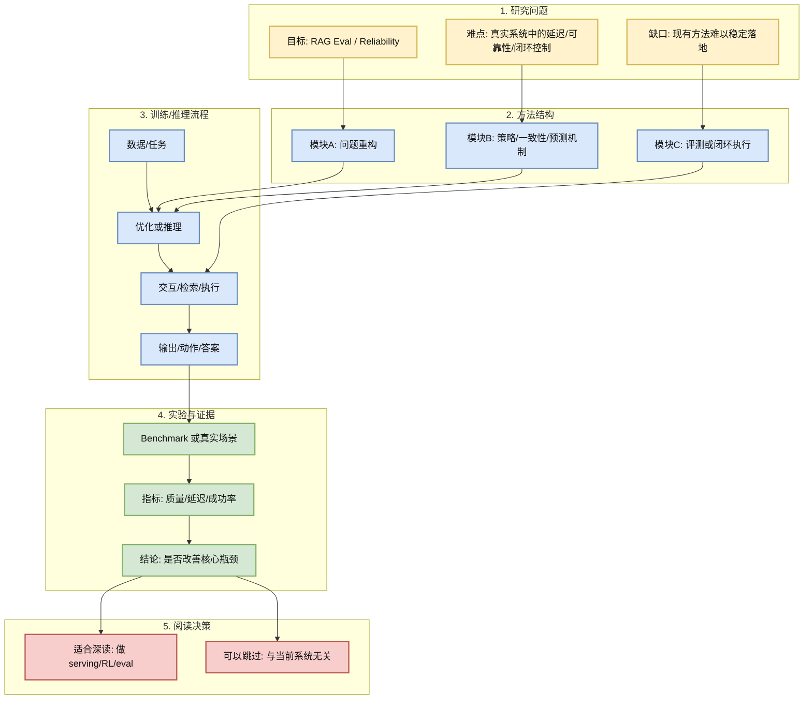
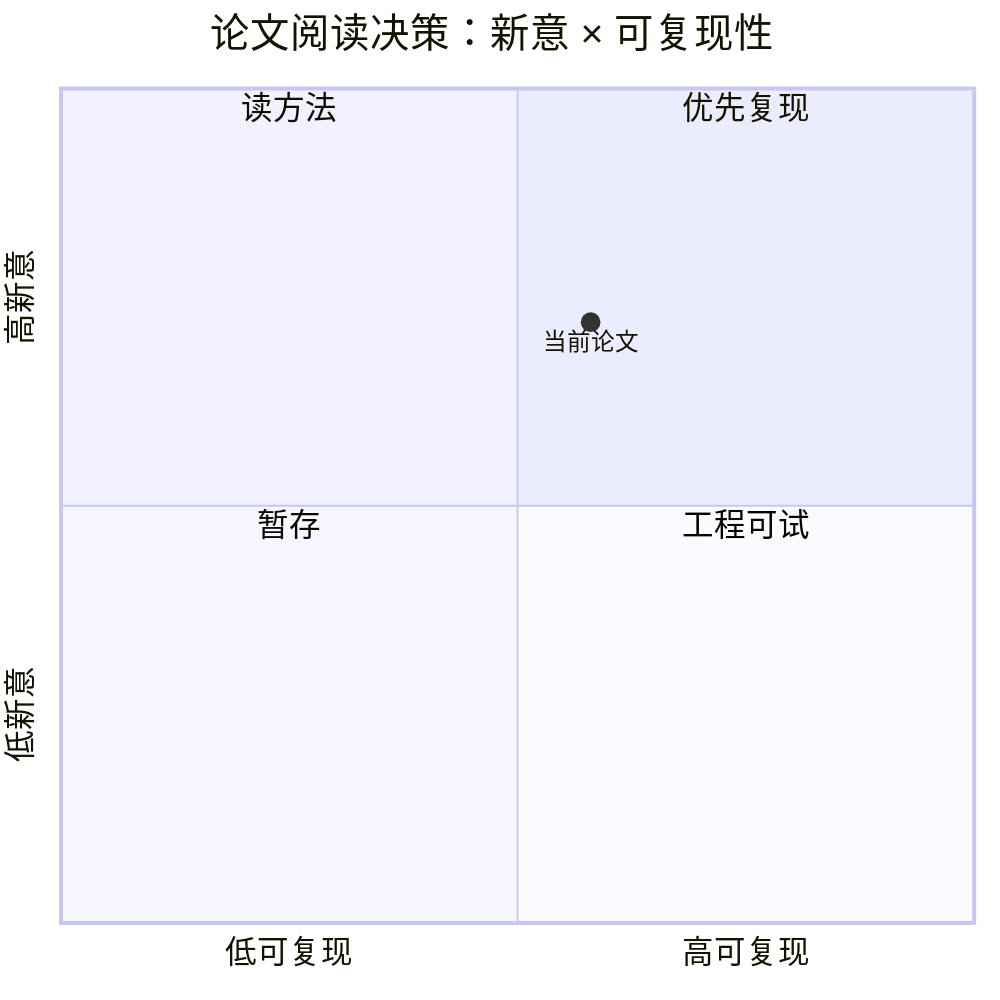

# CQC-RAG: Robust Retrieval-Augmented Generation via Cross-Query Consistency

> 类型：论文
> 大类：论文
> 小类：RAG Eval / Reliability
> 推荐等级：可 skim
> 创建日期：2026-06-12
> 原文链接：https://arxiv.org/abs/2606.13438v1
> PDF：https://arxiv.org/pdf/2606.13438v1
> 网页详情：https://github.com/dyt27666-oss/AI-news-report-obsidians/blob/main/Papers/RAG/CQC_RAG_cross_query_consistency_2026_06_12.md
> 返回日报：[[Daily/2026-06-12]]

## 一句话结论

通过语义等价查询的跨查询一致性评估答案稳定性，用 shared document pool + rerank + evidence-grounded protocol 过滤噪声诱发幻觉。

## TL;DR

- **研究问题**：通过语义等价查询的跨查询一致性评估答案稳定性，用 shared document pool + rerank + evidence-grounded protocol 过滤噪声诱发幻觉。
- **核心方法**：围绕 RAG Eval / Reliability 的系统机制或评测路径做改进。
- **关键结果**：摘要显示有明确实验或 benchmark 信号，但未做全文复现验证。
- **对我的价值**：RAG 线上可靠性常被 query 改写与检索波动击穿；该方法把 eval 信号嵌入推理路径，适合 agent memory/RAG 的自检模块。
- **建议动作**：先读方法图和实验设置，再判断是否复现。

## 论文信息

| 字段 | 内容 |
|---|---|
| 论文来源 | arXiv |
| 来源类型 | 预印本 |
| 标题 | CQC-RAG: Robust Retrieval-Augmented Generation via Cross-Query Consistency |
| 作者/机构 | Yanjia Sun, Sifan Liu, Jie Shao |
| 发布时间 | 2026-06-11 |
| arXiv | [abs](https://arxiv.org/abs/2606.13438v1) |
| OpenReview / 会议页 | 未发现 |
| Semantic Scholar | 未查询 |
| PDF | [pdf](https://arxiv.org/pdf/2606.13438v1) |
| 代码 | 未发现 |
| 方向 | RAG Eval / Reliability |

## 方法/系统图示

## 专业解读

RAG 线上可靠性常被 query 改写与检索波动击穿；该方法把 eval 信号嵌入推理路径，适合 agent memory/RAG 的自检模块。 这类论文值得关注的原因是：它把模型能力问题转化为系统约束问题，包括推理路径、环境闭环、评估稳定性或端到端延迟预算。对工程团队而言，真正有价值的是其机制是否能被抽象成可复用模块，而不是单个 benchmark 分数。

## 通俗解释

它试图让 AI 系统不只是“答得更好”，而是在真实交互里更稳、更快或更会行动。

## 方法拆解

| 组件 | 作用 | 输入 | 输出 | 关键假设 |
|---|---|---|---|---|
| 问题建模 | 定义要优化的系统瓶颈 | 任务/环境/查询 | 可优化目标 | 目标能代表真实体验 |
| 核心机制 | 改善闭环或可靠性 | 模型中间状态 | 策略/答案/动作 | 机制开销可控 |
| 评测协议 | 验证收益 | benchmark/真实任务 | 指标变化 | 数据集足够代表线上 |

## 实验与证据

| 实验 | 说明 | 我怎么看 |
|---|---|---|
| 摘要报告实验 | 有跨任务或闭环指标 | 需要阅读全文确认设置 |
| 工程可复现性 | 代码状态：未发现 | 有代码优先复现，无代码先读方法 |

## 局限性 / 风险

- 仅基于摘要筛选，尚未全文精读。
- benchmark 与真实线上 workload 可能存在偏差。
- 若依赖额外模型或环境，部署复杂度可能抵消收益。

## 对我的影响

| 维度 | 影响 | 建议动作 |
|---|---|---|
| AI Infra | 提供系统优化切入点 | 抽取可模块化机制 |
| LLM 工程 | 影响推理链路或可靠性 | 对照当前 serving/RAG pipeline |
| RL / Game AI | 对闭环环境/世界模型有参考 | 关注环境接口和 rollout 成本 |
| Agent / Eval | 可转成评测或自检模块 | 加入 eval harness 候选 |

## 相关链接

- 原文：https://arxiv.org/abs/2606.13438v1
- PDF：https://arxiv.org/pdf/2606.13438v1
- 网页详情：https://github.com/dyt27666-oss/AI-news-report-obsidians/blob/main/Papers/RAG/CQC_RAG_cross_query_consistency_2026_06_12.md
- 代码：未发现

## 标签

#ai-radar #paper #rag
