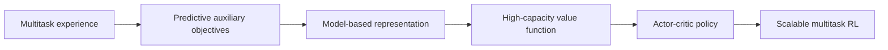

# Representation Learning Enables Scalable Multitask Deep Reinforcement Learning

> 类型：论文
> 分类：RL / Multitask / World Model
> 推荐等级：可收藏
> 创建日期：2026-06-08
> 原文链接：https://arxiv.org/abs/2606.05555v1

## 一句话结论

论文认为 scalable multitask RL 的关键未必是 planning，而是 predictive representation + 高容量 value approximation。

## 论文信息

- 标题：Representation Learning Enables Scalable Multitask Deep Reinforcement Learning
- 作者/机构：Johan Obando-Ceron, Lu Li, Scott Fujimoto, Pierre-Luc Bacon
- 发布时间：2026-06-04
- arXiv：https://arxiv.org/abs/2606.05555v1
- PDF：https://arxiv.org/pdf/2606.05555v1
- 代码：未在 arXiv 元数据中确认

## 专业解读

这篇对游戏/RL 训练很相关：它重新审视 model-based RL 成功来自哪里，提出 MR.Q：用预测式 model-based representations 加上高容量 value function，即使不规划也能在多任务上扩展。这对工程很重要，因为 planning 往往带来复杂 pipeline 和推理成本；如果 representation learning 是主要贡献，就可以设计更简单、更可扩展的 actor-critic 系统。

## 通俗解释

多任务 RL 不一定非要复杂地想象未来再规划，先学好环境表示，再用强价值函数，也可能很好用。

## 方法图示

## 解决什么问题

多任务 RL 扩展困难，model-based 方法强但复杂，关键组件不清楚。

## 核心方法

- 使用辅助预测目标学习 model-based representation。
- 与高容量 value approximation 结合。
- 用简单 model-free actor-critic 架构验证可扩展性。

## 和已有工作的差异

相比依赖 planning 的 model-based RL，它强调 representation 而非规划本身是主要驱动。

## 实验与证据

摘要称 MR.Q 超过近期 world-model 方法；具体 benchmark 和任务规模需读 PDF。

## 局限性

- 不规划是否适合极长 horizon 任务未知。
- 表示学习目标可能需要任务调参。

## 对我的影响

- AI Infra：训练 pipeline 可简化，减少 planning runtime。
- LLM 工程：Agent 表示学习可借鉴 auxiliary predictive objectives。
- RL / Game AI：必看方向，适合多游戏/多任务智能体。
- 建议动作：可收藏，后续读实验细节。

## 标签

#ai-radar #paper #rl #world-model #multitask
