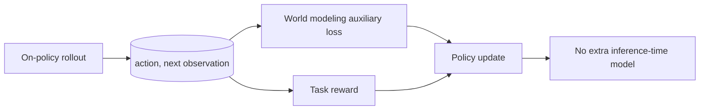

# Policy and World Modeling Co-Training for Language Agents

> 类型：论文
> 分类：Agent RL / World Model
> 推荐等级：必读
> 创建日期：2026-06-08
> 原文链接：https://arxiv.org/abs/2606.02388v1

## 一句话结论

PaW 在 on-policy RL rollout 中加入世界模型辅助监督，让语言 Agent 同时学习做什么和动作会导致什么。

## 论文信息

- 标题：Policy and World Modeling Co-Training for Language Agents
- 作者/机构：Ning Lu, Baijiong Lin, Shengcai Liu, Jiahao Wu
- 发布时间：2026-06-01
- arXiv：https://arxiv.org/abs/2606.02388v1
- PDF：https://arxiv.org/pdf/2606.02388v1
- 代码：未在 arXiv 元数据中确认

## 专业解读

LLM Agent 的 RL 往往只奖励动作结果，却没有显式训练模型理解环境转移。PaW 观察到 on-policy rollout 已经包含 action -> next observation 监督，因此可在同一 policy 上加入 world modeling auxiliary loss，而不改变推理范式。这对长程任务、游戏 Agent、工具使用 Agent 都很关键：策略如果能预测动作后果，credit assignment 和泛化可能更稳。

## 通俗解释

Agent 不只要学下一步做什么，还要学做了这一步世界会怎么变。PaW 把这两件事放在同一个训练循环里。

## 方法图示

## 解决什么问题

LLM Agent RL 缺少环境转移监督，世界模型通常需要额外 simulator 或训练阶段。

## 核心方法

- 使用 on-policy rollout 中的 action-next observation 对。
- 在 policy 训练中加入世界模型辅助监督。
- 不增加推理时额外世界模型调用。

## 和已有工作的差异

相比单独训练 world model 或用 simulator，PaW 把世界建模并入同一 policy/RL 训练流程。

## 实验与证据

摘要说明提出三项组件稳定辅助 WM 监督；具体任务和收益需读 PDF。

## 局限性

- 辅助目标权重可能影响策略优化。
- 复杂真实环境的 observation 噪声会影响世界模型学习。

## 对我的影响

- AI Infra：rollout 数据 schema 要保留 transition。
- LLM 工程：Agent RL 可加入 next-observation prediction loss。
- RL / Game AI：与游戏世界模型训练高度相关。
- 建议动作：必读，适合作为 Agent/game RL 训练方案候选。

## 标签

#ai-radar #paper #world-model #agent #rl
