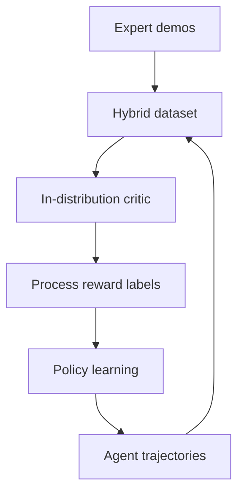

# Self-evolving LLM agents with in-distribution Optimization

> 类型：论文
> 分类：Agent RL / Long-horizon Decision Making
> 推荐等级：可 skim
> 创建日期：2026-06-08
> 原文链接：https://arxiv.org/abs/2606.07367v1

## 一句话结论

Q-Evolve 用 in-distribution critic 和自动过程奖励标注，缓解长程 LLM Agent 稀疏奖励 credit assignment。

## 论文信息

- 标题：Self-evolving LLM agents with in-distribution Optimization
- 作者/机构：Yudi Zhang, Meng Fang, Zhenfang Chen, Mykola Pechenizkiy
- 发布时间：2026-06-05
- arXiv：https://arxiv.org/abs/2606.07367v1
- PDF：https://arxiv.org/pdf/2606.07367v1
- 代码：未在 arXiv 元数据中确认

## 专业解读

长程 Agent 的难点是 episode 结束才有 reward，且 off-policy 数据与当前策略分布不匹配。Q-Evolve 把专家示范和 agent 自生成轨迹混合，学习 in-distribution critic，并用 implicit Q-learning 稳定 Bellman backup。这一方向把 LLM Agent 训练拉回经典 RL 的 critic/bootstrapping 框架，对游戏和交互式环境有启发。

## 通俗解释

它让 Agent 一边自己尝试任务，一边学一个过程打分老师，告诉它中间步骤好不好。

## 方法图示

## 解决什么问题

LLM Agent 长程决策存在稀疏延迟奖励和 credit assignment 问题。

## 核心方法

- 自动过程奖励标注。
- 混合专家示范与 agent 轨迹训练 in-distribution critic。
- 用 IQL 风格目标稳定稀疏奖励下的 Bellman backup。

## 和已有工作的差异

相比纯 GRPO/RLVR，它引入 critic 和过程奖励；相比普通 off-policy RL，它强调 in-distribution 优化。

## 实验与证据

摘要给出框架设定，具体环境、模型和代码需进一步确认。

## 局限性

- critic 质量决定训练稳定性。
- 专家示范依赖可能限制扩展。

## 对我的影响

- AI Infra：需要支持 trajectory replay 和 critic 训练。
- LLM 工程：适合长程工具 Agent。
- RL / Game AI：与稀疏奖励游戏训练高度相关。
- 建议动作：可 skim，关注是否开源。

## 标签

#ai-radar #paper #agent #rl #critic
