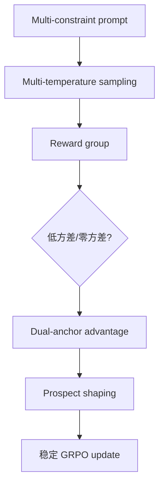

# MDP-GRPO: Stabilized Group Relative Policy Optimization for Multi-Constraint Instruction Following

> 类型：论文
> 分类：Post-training / GRPO
> 推荐等级：必读
> 创建日期：2026-06-08
> 原文链接：https://arxiv.org/abs/2606.06058v1

## 一句话结论

针对多约束指令跟随中的离散低方差奖励，提出多温采样、dual-anchor advantage 和 prospect shaping 来稳定 GRPO。

## 论文信息

- 标题：MDP-GRPO: Stabilized Group Relative Policy Optimization for Multi-Constraint Instruction Following
- 作者/机构：Mohammad Mahdi Salmani-Zarchi, Zahra Rahimi, Heshaam Faili, Mohammad Javad Dousti
- 发布时间：2026-06-04
- arXiv：https://arxiv.org/abs/2606.06058v1
- PDF：https://arxiv.org/pdf/2606.06058v1
- 代码：未在 arXiv 元数据中确认

## 专业解读

这篇论文很工程：它直接指出 z-score group normalization 在低离散 reward 下会出现低方差放大、均值中心化盲区、零方差崩塌。多约束 instruction following 正是 verifier 常给 0/1 或少数档位分数的场景，因此标准 GRPO 容易没有梯度或梯度异常。MDP-GRPO 的多温采样增加组内 reward dispersion，dual-anchor advantage 试图在 homogeneous group 中恢复学习信号。

## 通俗解释

如果一组答案分数几乎都一样，模型就不知道该学谁。MDP-GRPO 的目标是让分数太平的训练批次也能产生稳定学习信号。

## 方法图示

## 解决什么问题

标准 GRPO 在离散、低分散、多约束 reward 中训练不稳定。

## 核心方法

- Multi-temperature sampling 增加组内多样性。
- Dual-anchor advantages 缓解 homogeneous group 无梯度问题。
- Prospect-theoretic shaping 限制更新并惩罚约束违反。

## 和已有工作的差异

相比普通 GRPO 的单一组内 z-score 标准化，MDP-GRPO 显式处理 reward dispersion 和约束违反的非线性 shaping。

## 实验与证据

摘要给出三类病态和三项对应机制；需要读 PDF 确认具体任务、模型规模和 ablation。

## 局限性

- shaping 可能引入任务相关超参。
- 多温采样会增加推理采样成本。

## 对我的影响

- AI Infra：训练监控要记录 reward 方差和零方差 group 比例。
- LLM 工程：多约束 verifier 场景值得试验。
- RL / Game AI：离散 sparse reward 游戏训练有直接类比。
- 建议动作：必读，适合复现到内部 GRPO baseline。

## 标签

#ai-radar #paper #grpo #rlvr #instruction-following
