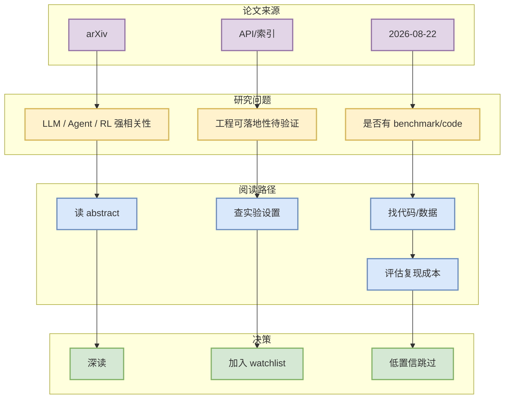

# arXiv scan failed: The read operation timed out

> 日期：2026-08-22  
> 论文来源：arXiv  
> 来源类型：API/索引  
> 发布时间：2026-08-22  
> abs：[https://export.arxiv.org/](https://export.arxiv.org/)  
> PDF：[未确认](未确认)

## 一句话结论
arXiv scan failed: The read operation timed out 被列入今日论文 watchlist；需要后续深读确认是否真正影响 LLM serving、post-training、agent eval 或 RL/game AI。

## TL;DR
- 作者/机构：多来源
- 分类：
- 摘要压缩：论文 API 访问失败，保留低置信 watchlist。
- 代码链接：未发现。

## 论文机制图

## 专业解读
当前只完成 metadata/abstract 层筛选。若论文与 inference serving、RLHF/post-training、agent evaluation 或 game/world model 的关键词重合，应继续检查方法、实验、baseline、开源代码和可复现性；否则保留为低置信 watchlist，避免用弱相关论文填充日报。

## 对我的影响
| 方向 | 可能价值 | 下一步 |
|---|---|---|
| AI Infra | 可能启发 serving/training/eval 设计 | 查方法和 benchmark |
| RL / Game AI | 可能启发 reward/env/world model | 查任务定义和代码 |
| Agent | 可能启发 eval/tool-use loop | 查实验设置 |

## 可信度与局限性
- 可信度：中低；来自 arXiv metadata/abstract，尚未阅读全文。
- 局限：未确认代码、引用和实验质量。

## 相关链接
- abs：https://export.arxiv.org/
- PDF：未确认
- 今日日报：[[Daily/2026-08-22]]

#ai-radar #paper #research-watchlist
