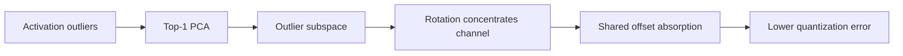

# OffQ: Taming Structured Outliers in LLM Quantization by Offsetting

> 类型：论文
> 分类：LLM Compression / Inference
> 推荐等级：可 skim
> 创建日期：2026-06-08
> 原文链接：https://arxiv.org/abs/2606.07116v1

## 一句话结论

OffQ 用 top-1 PCA 找激活 outlier 子空间，再通过旋转和 offset 吸收高幅值通道，缓解低比特量化退化。

## 论文信息

- 标题：OffQ: Taming Structured Outliers in LLM Quantization by Offsetting
- 作者/机构：Haoqi Wang, Lorenz K. Mueller, Jiawei Zhuang, Mathieu Salzmann
- 发布时间：2026-06-05
- arXiv：https://arxiv.org/abs/2606.07116v1
- PDF：https://arxiv.org/pdf/2606.07116v1
- 代码：未在 arXiv 元数据中确认

## 专业解读

低比特量化的实际瓶颈常常是 activation outliers。OffQ 的思路是先识别低维 outlier subspace，把高幅值激活集中到一个通道，再把 magnitude 转为共享 offset，降低激活标准差。对 serving 来说，这类方法如果不增加太多 runtime overhead，可能改善 W4A8/W4A4 等方案在真实模型上的稳定性。

## 通俗解释

大模型压缩时，少数异常大的激活值会让量化很难。OffQ 先把这些异常值收拢，再用偏移量处理，让压缩后精度更稳。

## 方法图示

## 解决什么问题

低比特量化因 activation outliers 导致性能下降。

## 核心方法

- top-1 PCA 识别低维 outlier 子空间。
- 旋转将高幅值激活集中到一个通道。
- 用共享 offset 吸收 outlier magnitude，降低激活方差。

## 和已有工作的差异

相比只裁剪或缩放 outlier，OffQ 更显式地利用 outlier 的结构化低维性质。

## 实验与证据

摘要报告在 LLM 低比特量化上降低性能退化；需读 PDF 确认模型、bitwidth 和 kernel 代价。

## 局限性

- 旋转/offset 是否能高效融合到推理 kernel 需要验证。
- 对 MoE/VLM/长上下文模型泛化未知。

## 对我的影响

- AI Infra：可纳入量化 serving watchlist。
- LLM 工程：适合关注精度-吞吐-显存三角。
- RL / Game AI：低成本 rollout 模型可能受益。
- 建议动作：可 skim，等待代码或 kernel 支持。

## 标签

#ai-radar #paper #quantization #serving #llm-compression
