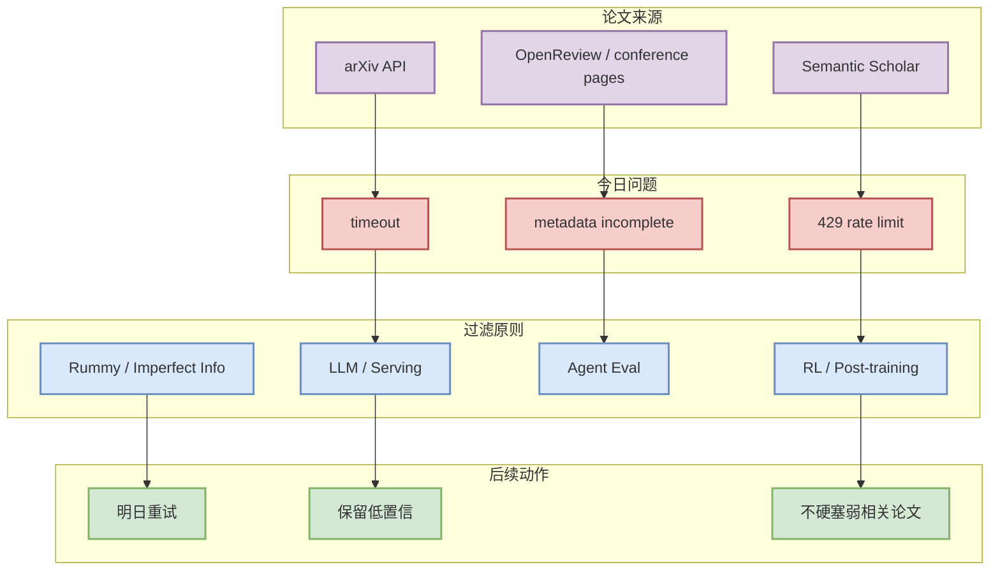

# Rummy imperfect-information game 论文源扫描 - 2026-07-14

> 一句话结论：今日 arXiv / Semantic Scholar 查询出现 timeout 或 429，未确认新的高相关论文；本页保留 provenance 和后续查询入口，避免把弱相关论文塞进日报。

## TL;DR

- 论文来源：arXiv / Semantic Scholar / 预印本索引扫描。
- 来源类型：API watchlist / low-confidence fallback。
- 查询：`rummy imperfect information game AI`。
- 今日状态：访问失败或低置信；未确认新增强相关论文。
- 原文入口：https://export.arxiv.org/api/query?search_query=all:rummy+imperfect+information+game+AI

## 信息压缩图示

## 专业解读

今天论文 API 的失败不应被“补空白”的弱相关论文替代。对 AI Infra / RL 工程工作，错误纳入泛 ML 或物理论文的成本高于空缺；更稳妥的做法是记录失败源，并用 GitHub serving / post-training watched repo 作为当天工程信号。

## 通俗解释

今天论文雷达没扫干净，所以先贴一个“低置信标签”。这不是没有研究价值，而是不能确定今天真的有值得读的新论文。

## 关键机制拆解

| 环节 | 今日结果 | 风险 | 下一步 |
|---|---|---|---|
| 查询 | timeout / 429 | 缺失新论文 | 明日重试 |
| 过滤 | 未拿到 metadata | 误收弱相关 | 坚持强相关过滤 |
| 替代信号 | GitHub watched repos | 不是论文证据 | 只作工程观察 |

## 对我的影响

- Serving：先看 vLLM / SGLang / TensorRT-LLM 活跃度。
- Post-training：先看 verl / OpenRLHF。
- Rummy：先看 ISMCTS / rule engine / RL lab repo。

## 相关链接

- 查询入口：https://export.arxiv.org/api/query?search_query=all:rummy+imperfect+information+game+AI
- 今日日报：[[Daily/2026-07-14]]

#ai-radar #paper-watchlist #low-confidence
