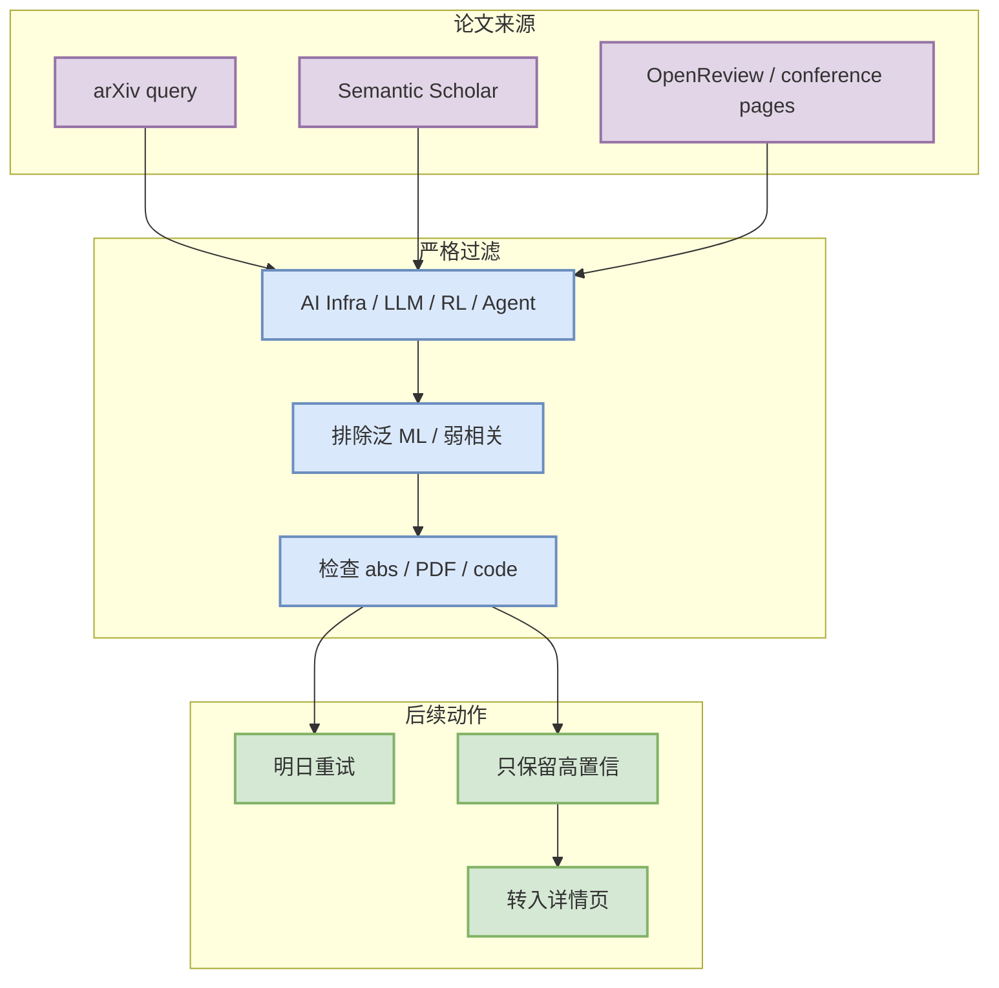

# LLM serving / inference

> 日期：2026-07-16
> 类型：论文 / 资料 watchlist
> 来源：https://export.arxiv.org/api/query?search_query=all:large+language+model+inference

## 一句话结论

今日未确认新增高置信 LLM serving / inference 论文；保留来源入口和后续查询策略，避免把弱相关或 API 失败结果误报成必读。

## TL;DR

- 来源类型：arXiv / Semantic Scholar / 预印本索引扫描。
- 今日状态：低置信；GitHub Search 与论文源均有 rate limit / timeout 风险。
- 策略：日报只保留 watchlist，不把弱相关论文混入必读。

## 信息压缩图示

## 判断矩阵

| 维度 | 今日判断 | 说明 |
|---|---|---|
| 相关性 | 待确认 | 需要能映射到 serving/training/post-training/agent/eval/game AI。 |
| 可验证性 | 低 | 本轮未确认稳定 abs/PDF/代码链接。 |
| 行动 | 观察 | 明日重试，不作为今天必读。 |

## 相关链接

- 来源入口：https://export.arxiv.org/api/query?search_query=all:large+language+model+inference
- 日报：[[Daily/2026-07-16]]

#ai-radar #paper-watchlist #low-confidence
