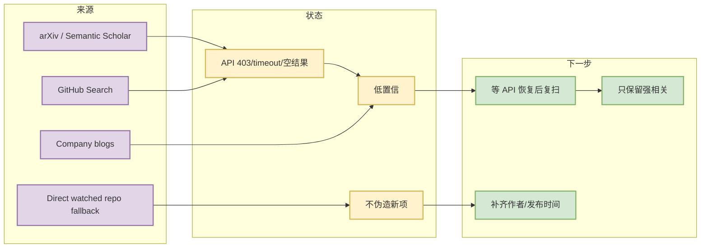

# LLM Serving / Agent Eval / World Model source scan

> 日期：2026-07-21
> 来源类型：低置信 watchlist / API fallback

## 一句话结论

今日未获得可验证的强相关新增 论文 条目，因此保留 watchlist 详情页，避免日报固定板块缺失或伪造新内容。

## TL;DR

- GitHub Search 今日 403；大厂官网/论文源只能部分入口扫描。
- 该页用于承接 Daily 的低置信来源说明。
- 后续需要在 API 恢复后补查原文、发布时间、作者/机构与代码链接。

## 信息压缩图示

## 可信度与局限性

| 项 | 状态 |
|---|---|
| 新论文/博客真实性 | 低置信，未写成正式新项 |
| 原文链接 | 使用来源入口或查询 URL |
| 可行动性 | 中：作为后续复扫清单 |

## 我应该如何跟进

- API 恢复后优先补扫：LLM serving、agent eval、post-training、world model、Rummy imperfect-information game。
- 若发现强相关论文，再创建标准 paper detail 页。

#ai-radar #watchlist #low-confidence
