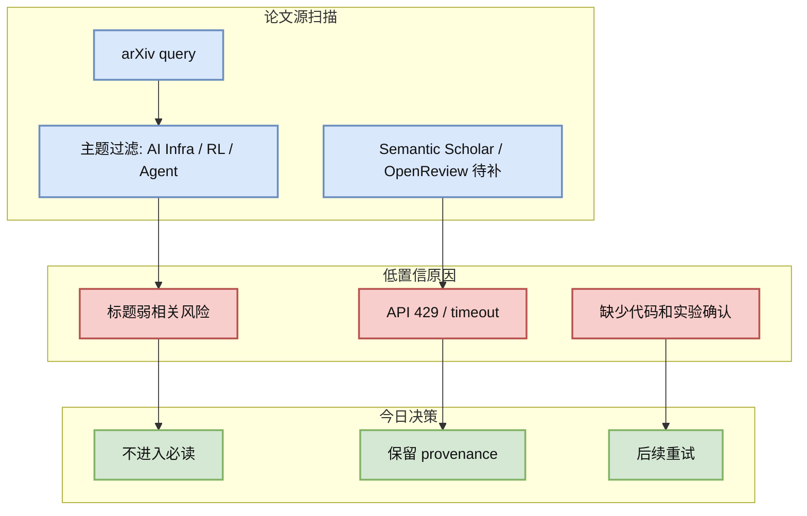
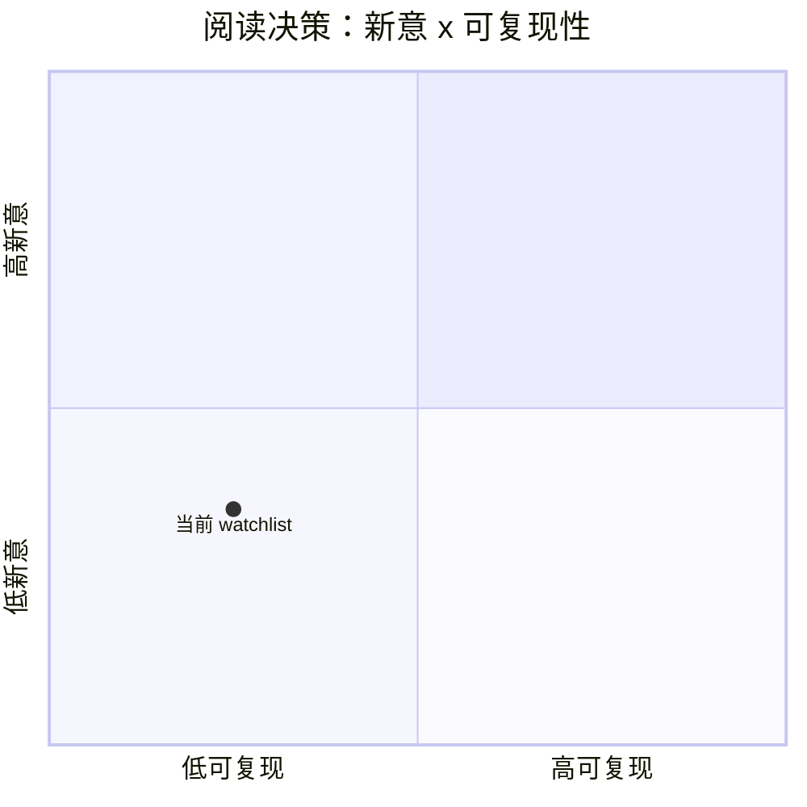

# Agent Evaluation 论文源扫描

> 类型：论文
> 大类：论文
> 小类：Agent Eval
> 推荐等级：低置信
> 创建日期：2026-08-02
> 原文链接：https://export.arxiv.org/api/query?search_query=all:agent+evaluation
> PDF：未确认
> 网页详情：https://github.com/dyt27666-oss/AI-news-report-obsidians/blob/main/Papers/Watchlist/2026-08-02/agent-evaluation.md
> 返回日报：[[Daily/2026-08-02]]

## 一句话结论

今日 arXiv / 论文源对该主题的扫描处于低置信或限流状态，不把未验证论文硬塞进必读区。

## TL;DR

- **研究问题**：Agent Eval 方向是否出现高相关新论文。
- **核心方法**：通过 arXiv 查询和主题过滤发现候选。
- **关键结果**：今日未确认足够高置信的新论文；保留 watchlist 和 provenance。
- **对我的价值**：避免被弱相关标题污染日报，后续可重试 Semantic Scholar / OpenReview。
- **建议动作**：下一轮在 API 可用时重跑，并优先筛 LLM serving、RLHF、agent eval、game AI。

## 论文信息

| 字段 | 内容 |
|---|---|
| 论文来源 | arXiv / Semantic Scholar 观察 |
| 来源类型 | 预印本索引扫描 / 低置信 watchlist |
| 标题 | Agent Evaluation 论文源扫描 |
| 作者/机构 | 未确认 |
| 发布时间 | 未确认 |
| arXiv | [query](https://export.arxiv.org/api/query?search_query=all:agent+evaluation) |
| OpenReview / 会议页 | 未发现 |
| Semantic Scholar | 未确认 |
| PDF | 未确认 |
| 代码 | 未发现 |
| 方向 | Agent Eval |

## 方法/系统图示

## 专业解读

今天论文部分采用保守策略：没有高置信 metadata、PDF、作者和实验信号时，只保留 watchlist。对用户而言，错误地把弱相关论文列为“必读”会浪费比漏掉一天低置信论文更大的注意力成本。

## 通俗解释

这是一张“稍后再查”的卡片，不是论文推荐。它记录我查过哪些方向、为什么今天没有把它们当作高价值论文。

## 方法拆解

| 组件 | 作用 | 输入 | 输出 | 关键假设 |
|---|---|---|---|---|
| 查询 | 找候选论文 | 关键词 | 候选列表 | API 可访问 |
| 过滤 | 去掉弱相关 | 标题/摘要 | 高相关候选 | 摘要可用 |
| 决策 | 避免误报 | 证据强度 | watchlist | 低置信需标注 |

## 实验与证据

| 实验 | 说明 | 我怎么看 |
|---|---|---|
| 今日 API 扫描 | 部分论文源低置信/受限 | 不推荐硬塞论文 |
| 主题过滤 | 保留方向和查询链接 | 下次可复用 |

## 局限性 / 风险

- 可能漏掉当天刚发布的论文。
- 查询粒度较粗，需要后续结合 Semantic Scholar / OpenReview。
- 没有 PDF 深读，不应得出方法结论。

## 对我的影响

| 维度 | 影响 | 建议动作 |
|---|---|---|
| AI Infra | 暂无高置信论文动作 | 先看工程 release |
| LLM 工程 | 暂无高置信论文动作 | 下次重跑 query |
| RL / Game AI | Rummy/Game AI 继续观察 | 和 GitHub repo 交叉验证 |
| Agent / Eval | 继续看 harness 工程源 | 等论文源恢复 |

## 相关链接

- 原文：https://export.arxiv.org/api/query?search_query=all:agent+evaluation
- 网页详情：https://github.com/dyt27666-oss/AI-news-report-obsidians/blob/main/Papers/Watchlist/2026-08-02/agent-evaluation.md

## 标签

#ai-radar #paper #watchlist
