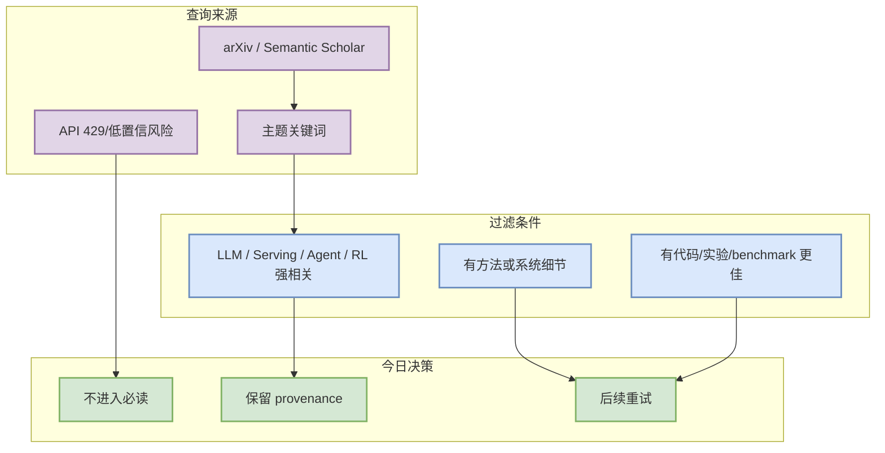

# LLM Serving / Inference 论文源扫描

> 类型：Research Watchlist
> 大类：论文 / 低置信来源
> 小类：AI Infra / Agent / Game AI
> 推荐等级：低置信
> 创建日期：2026-08-03
> 原文链接：https://export.arxiv.org/api/query?search_query=all:large+language+model+inference
> 网页详情：https://github.com/dyt27666-oss/AI-news-report-obsidians/blob/main/Papers/Watchlist/2026-08-03/llm-serving-inference.md
> 返回日报：[[Daily/2026-08-03]]

## 一句话结论

今日把 `LLM Serving / Inference 论文源扫描` 保守记录为 watchlist：用于保留查询 provenance，不把未验证论文包装成必读结论。

## TL;DR

- **它是什么**：围绕主题的 arXiv / Semantic Scholar / 开放网页检索入口。
- **为什么重要**：LLM serving 论文可能给出调度、KV cache、speculative decoding 与系统 benchmark 的新信号。
- **和我相关的点**：避免论文源 429/低相关结果污染 AI Infra / RL 工程优先级。
- **建议动作**：后续在 API 恢复后按标题、摘要、代码和实验强相关性重筛。

## 信息压缩图示

## 可信度与局限性

- 证据强度：低；本页是来源监控，不是论文推荐。
- 局限性：没有完整阅读全文和代码验证。
- 下一步：API 恢复后补充真实论文详情页。

## 相关链接

- 原文：https://export.arxiv.org/api/query?search_query=all:large+language+model+inference
- 网页详情：https://github.com/dyt27666-oss/AI-news-report-obsidians/blob/main/Papers/Watchlist/2026-08-03/llm-serving-inference.md

## 标签

#ai-radar #paper-watchlist #low-confidence
