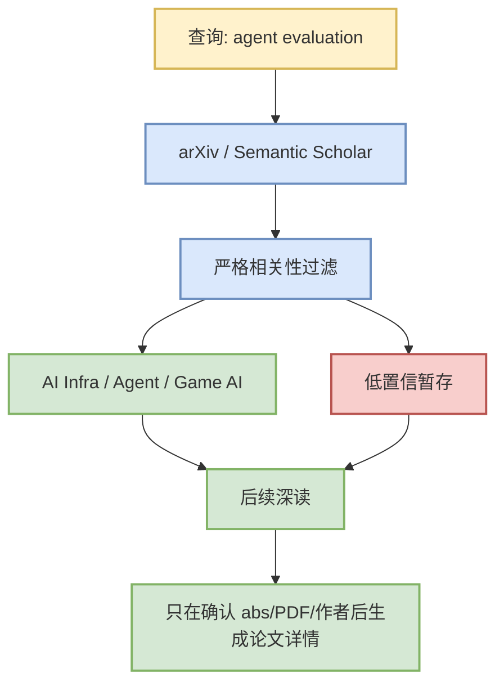

# Agent evaluation 论文源扫描 - 2026-08-04

> 一句话结论：今日论文源保守处理为 watchlist，避免在 API/元数据不完整时把弱相关论文包装成必读。

## 元信息

| 字段 | 值 |
|---|---|
| 论文来源 | arXiv API / Semantic Scholar 待复核 |
| 来源类型 | 预印本索引扫描 / 低置信 watchlist |
| 查询 | `agent evaluation` |
| 原文 | https://export.arxiv.org/api/query?search_query=all:agent+evaluation |

## 信息压缩图示

## 专业解读

和 coding-agent loop 的 eval harness / regression testing 强相关。 今日因为上游源稳定性不足，日报保留来源链接和主题判断，不写未经核验的论文摘要。

## 跟进

- API 恢复后读取 abs/PDF。
- 只保留 AI Infra、LLM、RL、Agent、Eval、Serving、Training、Post-training、World Model、Game AI 强相关论文。
- 生成正式论文详情时必须补作者、发布时间、abs、PDF、代码链接和来源类型。

#ai-radar #paper-watchlist
