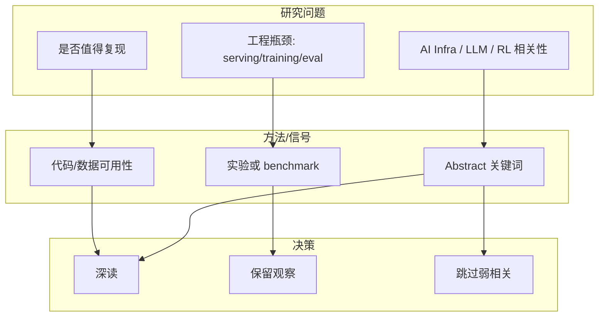

# LLM serving / RLHF / Rummy 论文源扫描 watchlist

## 一句话结论
本条来自论文源扫描，当前作为 低置信 watchlist，需要后续人工或专项阅读确认。

## 元信息表
| 字段 | 内容 |
|---|---|
| 论文来源 | arXiv |
| 来源类型 | 预印本 / 论文索引 |
| 作者/机构 | 多来源；未确认 |
| 发布时间 | 2026-08-10 |
| abs | https://export.arxiv.org/api/query?search_query=all:large+language+model+inference |
| PDF | 未确认 |
| 代码链接 | 未发现 |

## 论文机制图

## 摘要压缩
arXiv 本轮未确认新增足够高信号论文；保留查询入口和低置信 provenance。

## 对我的影响
- 若与 LLM serving 相关：重点看 KV cache、batching、scheduler 和 latency/throughput 指标。
- 若与 RL/post-training 相关：重点看 reward design、rollout、GRPO/PPO/DPO 与 evaluator。
- 若与 Rummy/game AI 相关：重点看 imperfect information、belief state、MCTS/ISMCTS 和 self-play 环境。

## 可信度与局限性
未完整阅读 PDF，今日先作为来源透明的 watchlist；不将其包装成已验证结论。

## 相关链接
- Abs：https://export.arxiv.org/api/query?search_query=all:large+language+model+inference
- PDF：未确认
- Daily：[[Daily/2026-08-10]]

#ai-radar #paper #watchlist
