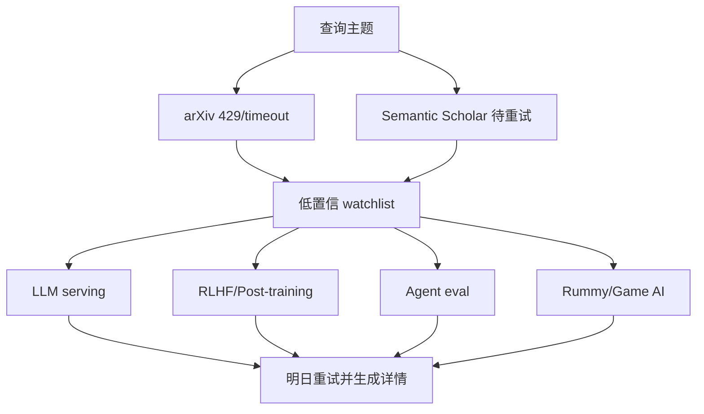

# 论文源 Watchlist - 2026-08-12

> 来源：arXiv API / Semantic Scholar retry queue  
> 状态：低置信；arXiv 今日 429/timeout，未把未验证论文写成必读。

## 一句话结论
今天论文源不可稳定访问，保留 LLM serving、RLHF、Agent Eval、World Model、Rummy imperfect-information game 的重试入口。

## 查询入口
| 主题 | 来源类型 | 原文链接 | 今日处理 |
|---|---|---|---|
| LLM serving | arXiv 预印本索引 | https://export.arxiv.org/api/query?search_query=all:large+language+model+inference | 429/timeout，低置信 |
| RLHF / post-training | arXiv 预印本索引 | https://export.arxiv.org/api/query?search_query=all:reinforcement+learning+language+models | timeout，低置信 |
| Agent evaluation | arXiv 预印本索引 | https://export.arxiv.org/api/query?search_query=all:agent+evaluation | 429，低置信 |
| Rummy imperfect information | arXiv 预印本索引 | https://export.arxiv.org/api/query?search_query=all:rummy+imperfect+information+game+AI | 429，低置信 |

## 跟进
明日优先重试，不在 API 失败时杜撰论文摘要。

#ai-radar #paper-watchlist
