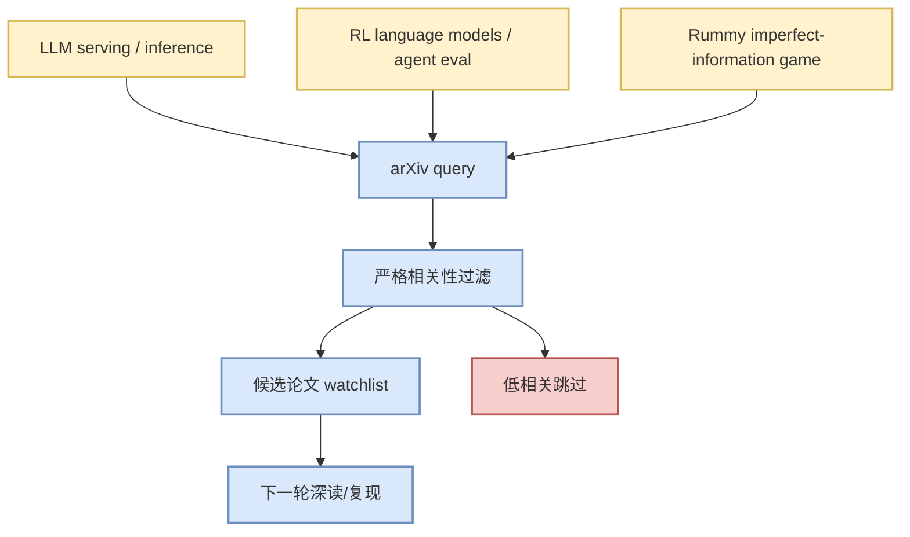

# Paper Source Watchlist - 2026-08-14

> 一句话结论：今日论文 API 可访问性/相关性有限，只把可追踪 arXiv 条目作为 watchlist，不编造论文结论。

## 候选

## 失败/低置信

- LLM serving inference scheduler: The read operation timed out
- reinforcement learning language models agent evaluation: The read operation timed out
- gin rummy imperfect information game AI: The read operation timed out

#ai-radar #papers #watchlist
