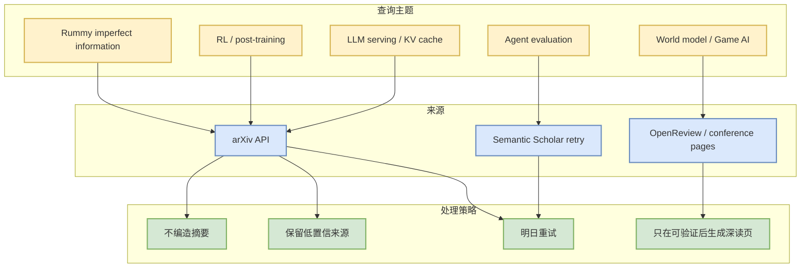

# Paper Source Watchlist - 2026-08-15

> 日期：2026-08-15
> 来源类型：arXiv API / Semantic Scholar retry watchlist
> 原文：https://export.arxiv.org/api/query

## 一句话结论
今日 arXiv 在多条 AI Infra / RL / Agent / Rummy 查询上返回 429 或 timeout，因此只保留透明 watchlist，不把未验证论文升级为高置信结论。

## TL;DR
- 查询方向：LLM serving inference KV cache、RL language models post-training、agent evaluation benchmark、world model RL game agents、rummy imperfect-information game AI。
- 状态：API 429 / timeout；未可靠得到可验证 metadata。
- 决策：日报保留论文板块和低置信说明，下一轮重试 arXiv / Semantic Scholar。

## 信息压缩图示

## 重试矩阵
| 主题 | 今日状态 | 下一步 |
|---|---|---|
| LLM serving / KV cache | arXiv 429 | 明日降低频率重试，必要时用 Semantic Scholar search |
| RL / post-training | arXiv 429 | 只保留与 GRPO/RLHF/RLAIF/rollout 相关项 |
| Agent evaluation | arXiv 429 | 优先筛 benchmark/eval harness 论文 |
| World model / Game AI | timeout | 重试 game RL/world model/self-play |
| Rummy imperfect information | timeout | 重试 ISMCTS/MCTS/belief abstraction/card game AI |

## 可信度与局限性
本页是 source-health 记录，不是论文推荐页。只有当 abs/PDF/作者/发布日期可验证后，才生成正式论文详情页。

## 相关链接
- Daily：[[Daily/2026-08-15]]
- arXiv API：https://export.arxiv.org/api/query

#ai-radar #paper #watchlist #low-confidence
