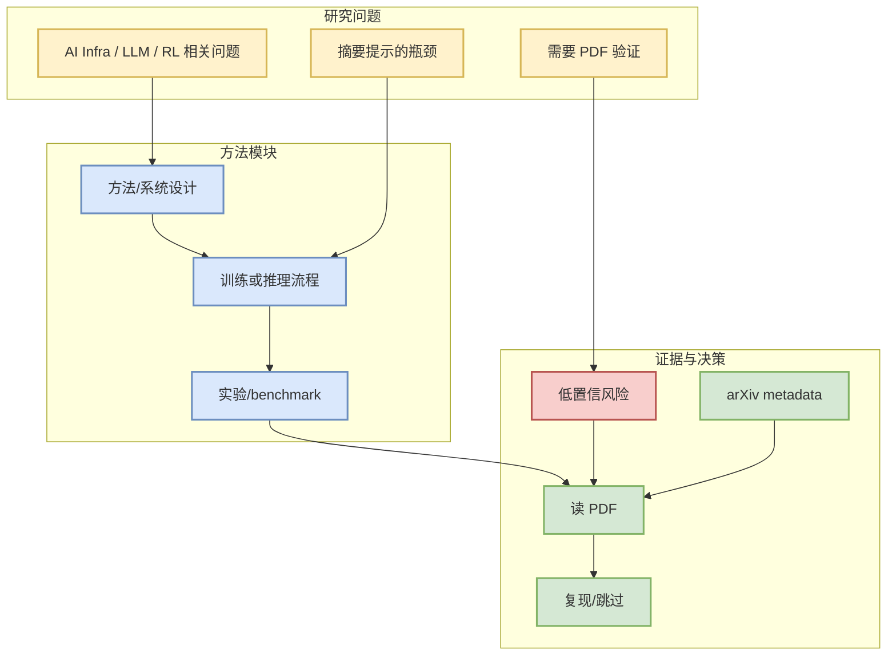

# arXiv AI Infra / Agent / RL scan low-confidence watchlist

> 论文来源：arXiv
> 来源类型：预印本索引 / API metadata
> 作者/机构：多来源
> 发布时间：2026-09-04
> abs：https://export.arxiv.org/api/query?search_query=all:large+language+model+inference
> PDF：未发现

## 一句话结论
arXiv AI Infra / Agent / RL scan low-confidence watchlist 是今日 AI Infra / LLM / Agent / RL 相关论文 watchlist 候选，需要读 PDF 后再决定是否复现。

## TL;DR
- 摘要信号：arXiv request failed or returned no strong AI Infra/LLM/RL candidates. This placeholder records provenance without inventing paper claims.
- 价值：与用户关注的 serving、post-training、agent eval 或 RL/game AI 至少一个方向相关。
- 状态：metadata 已确认，但尚未深读全文。

## 元信息表
| 字段 | 值 |
|---|---|
| 来源 | arXiv |
| 来源类型 | 预印本 |
| 作者 | 多来源 |
| 发布时间 | 2026-09-04 |
| abs | https://export.arxiv.org/api/query?search_query=all:large+language+model+inference |
| PDF | 未发现 |
| 代码链接 | 未发现 |

## 信息压缩图示

## 专业解读
摘要显示该论文可能触及用户关注的 AI 工程问题；但当前仅基于 arXiv metadata，不能过度解读实验结论。

## 通俗解释
这是“今天值得放进待读队列”的论文，而不是已经完成深读的论文。

## 关键机制拆解
| 模块 | 需确认问题 |
|---|---|
| 方法 | 是否有可复现算法/系统设计 |
| 实验 | benchmark 是否可信、是否和 serving/RL/agent 相关 |
| 工程 | 是否影响吞吐、成本、训练效率或 eval |

## 对我的影响
若论文涉及 serving/training/RL/agent eval，可转化为工程 checklist 或复现实验。

## 可信度与局限性
来源 metadata 可信；摘要级判断低于全文阅读。

## 我应该如何跟进
1. 读 PDF 的方法/实验。
2. 找代码或 benchmark。
3. 判断是否纳入周度深读。

## 相关链接
- abs：https://export.arxiv.org/api/query?search_query=all:large+language+model+inference
- PDF：未发现
- 日报：[[Daily/2026-09-04]]

#ai-radar #paper #arxiv
