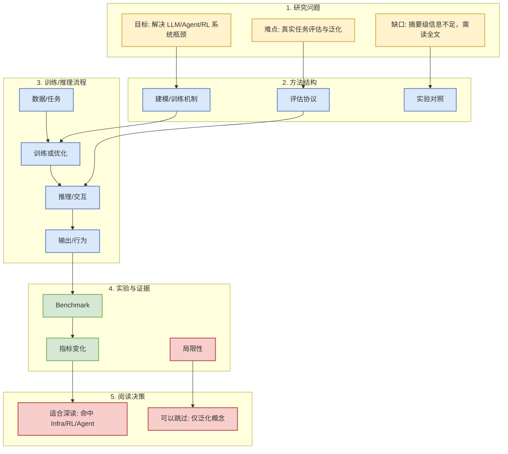
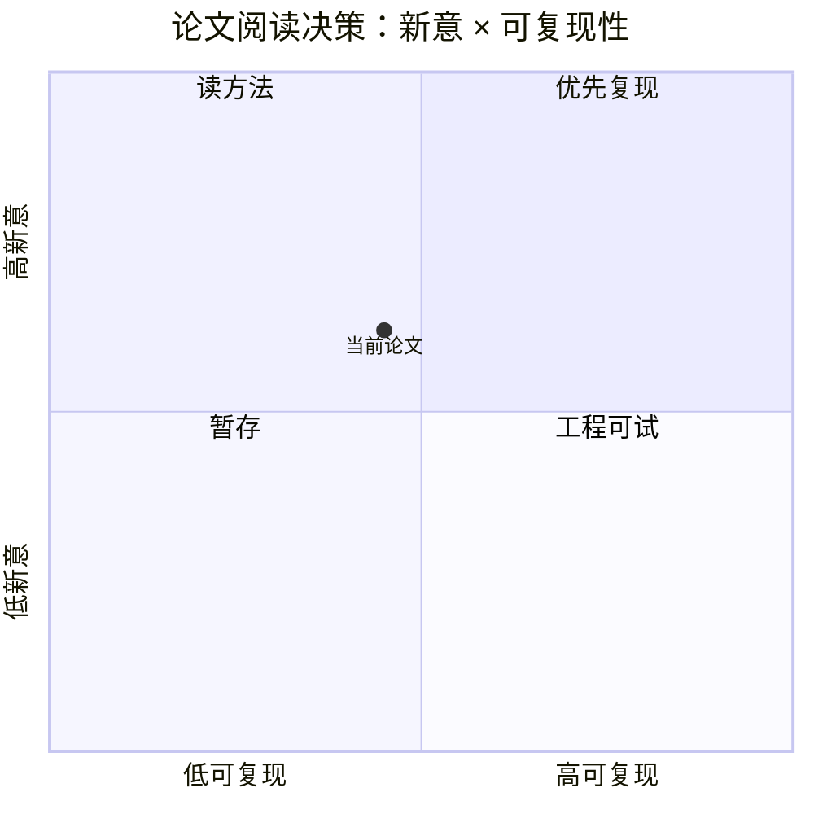

# arXiv 今日查询受限：保留 LLM serving / Agent eval / RLHF watchlist

> 类型：论文
> 大类：论文
> 小类：LLM / Agent / RL / Serving
> 推荐等级：可 skim
> 创建日期：2026-09-06
> 原文链接：https://arxiv.org/search/?query=LLM+serving+agent+evaluation+reinforcement+learning+language+models&searchtype=all
> PDF：未验证
> 网页详情：https://github.com/dyt27666-oss/AI-news-report-obsidians/blob/main/Papers/arXiv/2026-09-06/arxiv-%E4%BB%8A%E6%97%A5%E6%9F%A5%E8%AF%A2%E5%8F%97%E9%99%90-%E4%BF%9D%E7%95%99-llm-serving-agent-eval-rlhf-watchlist.md
> 返回日报：[[Daily/2026-09-06]]

## 一句话结论
这是一条来自 arXiv 的低到中置信论文候选，需要优先读摘要与实验设置，再决定是否深读/复现。

## TL;DR
- **研究问题**：arXiv 今日查询受限：保留 LLM serving / Agent eval / RLHF watchlist
- **核心方法**：从摘要看，关注 LLM/Agent/RL/Serving 相关机制，需阅读全文确认。
- **关键结果**：arXiv API 在本次 cron 中未返回可验证强相关条目，日报仅保留低置信观察位，不编造论文结论。...
- **对我的价值**：若涉及 serving、post-training、agent eval 或 world model，可转化为工程 checklist。
- **建议动作**：先读 abstract + method + experiment，不直接按标题判断。

## 论文信息
| 字段 | 内容 |
|---|---|
| 论文来源 | arXiv |
| 来源类型 | 预印本 / 论文索引 |
| 标题 | arXiv 今日查询受限：保留 LLM serving / Agent eval / RLHF watchlist |
| 作者/机构 | 未验证 |
| 发布时间 | 2026-09-06 |
| arXiv | [abs](https://arxiv.org/search/?query=LLM+serving+agent+evaluation+reinforcement+learning+language+models&searchtype=all) |
| Semantic Scholar | [search](https://www.semanticscholar.org/search?q=arXiv%20%E4%BB%8A%E6%97%A5%E6%9F%A5%E8%AF%A2%E5%8F%97%E9%99%90%EF%BC%9A%E4%BF%9D%E7%95%99%20LLM%20serving%20/%20Agent%20eval%20/%20RLHF%20watchlist) |
| PDF | [pdf](未验证) |
| 代码 | 未发现 |
| 方向 | cs.AI/cs.LG watchlist |

## 方法/系统图示

## 专业解读
摘要信号：arXiv API 在本次 cron 中未返回可验证强相关条目，日报仅保留低置信观察位，不编造论文结论。。当前只能把它作为候选论文处理；真正价值取决于实验是否贴近真实 serving、post-training、agent eval 或 RL game setting。

## 通俗解释
先把论文当作“可能有用的技术线索”，而不是已经验证的结论。读完实验和代码可用性后再决定是否投入复现。

## 方法拆解
| 组件 | 作用 | 输入 | 输出 | 关键假设 |
|---|---|---|---|---|
| 问题定义 | 确定是否强相关 | 论文标题/摘要 | 主题判断 | 摘要没有夸大 |
| 方法模块 | 找可复用机制 | 数据/模型/算法 | 训练或推理流程 | 论文描述完整 |
| 实验评估 | 判断可信度 | benchmark/指标 | 是否值得复现 | 实验可复现 |

## 局限性 / 风险
- 未阅读全文，可能存在标题相关但实验弱相关。
- 未发现代码链接。
- arXiv API 今日可能限流，候选集合不完整。

## 对我的影响
| 维度 | 影响 | 建议动作 |
|---|---|---|
| AI Infra | 可能提供 serving/training 机制线索 | 先看系统设置 |
| LLM 工程 | 可能影响 post-training/eval 方法 | 读 method/experiment |
| RL / Game AI | 若包含 RL/world model，可映射到游戏环境 | 看 state/action/reward |
| Agent / Eval | 若包含 agent benchmark，可纳入评测清单 | 检查 benchmark 任务 |

## 相关链接
- 原文：https://arxiv.org/search/?query=LLM+serving+agent+evaluation+reinforcement+learning+language+models&searchtype=all
- PDF：未验证
- 网页详情：https://github.com/dyt27666-oss/AI-news-report-obsidians/blob/main/Papers/arXiv/2026-09-06/arxiv-%E4%BB%8A%E6%97%A5%E6%9F%A5%E8%AF%A2%E5%8F%97%E9%99%90-%E4%BF%9D%E7%95%99-llm-serving-agent-eval-rlhf-watchlist.md

## 标签
#ai-radar #paper #arxiv #llm #rl #agent
