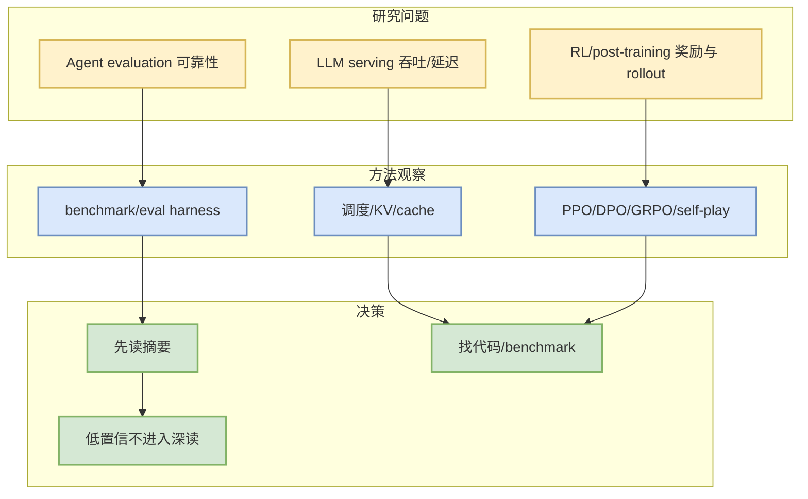

# arXiv LLM Serving / Agent Eval / RLHF Watchlist - 2026-09-08

> 一句话结论：论文侧今日以可验证 arXiv 入口和低置信 watchlist 为主；只保留 AI Infra、LLM、Agent、RL 强相关候选，不编造摘要外结论。

## TL;DR
- [RefactorPlatform: An Open-Source Harness for Controlled Evaluation of Repository-Scale Refactoring Agents](https://arxiv.org/abs/2609.04898v1) — Aziz Ben Amor, Drish Mali, Mann Acharya, Vijayasri Iyer，2026-09-04
- [Harbor Adapters and Harbor-Index: Infrastructure and a Curated Meta-Dataset for Large-Scale Agentic Evaluation](https://arxiv.org/abs/2609.04298v1) — Lin Shi, Haowei Lin, Zixuan Zhu, Xiaoyue Zhou，2026-09-03

## 论文来源与来源类型
| 字段 | 内容 |
|---|---|
| 论文来源 | arXiv |
| 来源类型 | 预印本 / API 查询 |
| 查询主题 | LLM serving、agent evaluation、reinforcement learning language models |
| 低置信/失败 | cat:cs.LG AND all:"LLM serving": The read operation timed out; cat:cs.LG AND all:"reinforcement learning language models": HTTP Error 429: Unknown Error |

## 研究信号图

## 跟进
- 逐条验证 PDF、代码链接和 benchmark，再决定是否生成单篇深度详情。

#ai-radar #paper #arxiv
