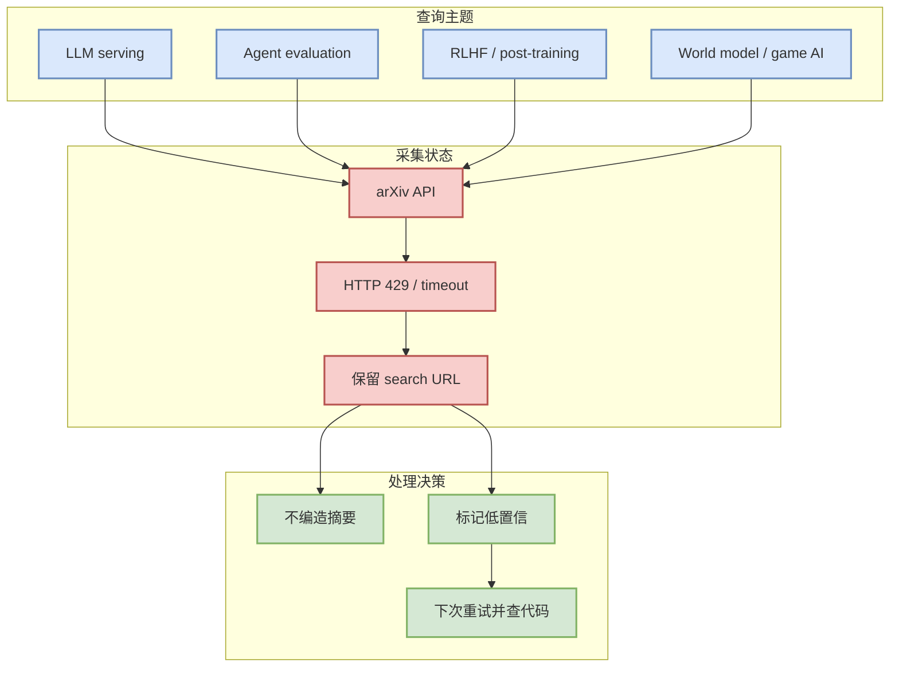
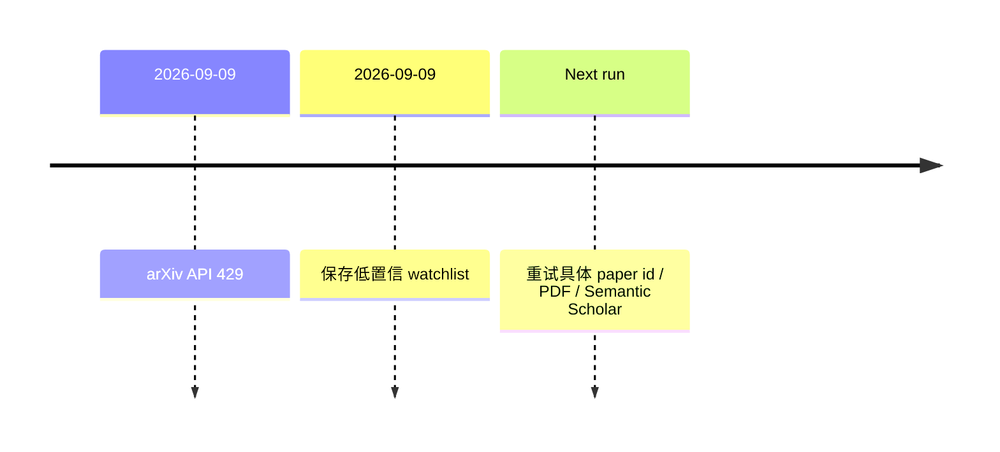

# arXiv LLM / Agent / RL / Serving watchlist - 2026-09-09

> 类型：论文来源扫描 / 低置信 watchlist
> 论文来源：arXiv
> 来源类型：预印本索引 / API 429 fallback
> 创建日期：2026-09-09
> 原文链接：https://arxiv.org/search/?query=LLM+serving+agent+evaluation+reinforcement+learning+language+models&searchtype=all
> 返回日报：[[Daily/2026-09-09]]

## 一句话结论
今日 arXiv API 对强相关查询返回 429，因此只保留 LLM serving、agent evaluation、RLHF/post-training 的低置信检索入口，不编造论文摘要。

## 信息压缩图示

## 专业解读
论文板块今天的正确行为是透明记录失败，而不是用过期或未验证论文填表。后续重试时应优先限定 cs.AI/cs.LG/cs.CL/stat.ML，并只保留和 serving、agent eval、post-training、RL/game AI 强相关的论文。

## 我应该如何跟进
1. API 恢复后重试 arXiv 查询并抓取具体 ID。
2. 对每篇候选补 Semantic Scholar citation / code / PDF。
3. 只把强相关论文升级到日报必读。

## 相关链接
- arXiv search：https://arxiv.org/search/?query=LLM+serving+agent+evaluation+reinforcement+learning+language+models&searchtype=all
- 返回日报：[[Daily/2026-09-09]]

#ai-radar #paper-watchlist #arxiv
