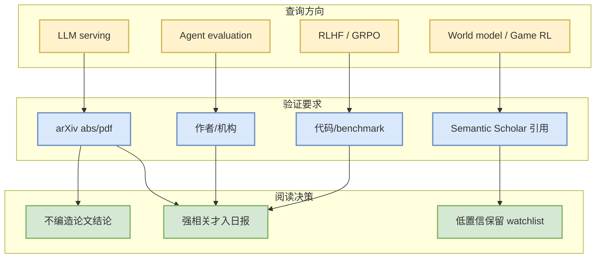

# arXiv LLM Serving / Agent Eval / RLHF Watchlist - 2026-09-10

> 论文来源：arXiv / Semantic Scholar 预印本索引  
> 来源类型：API 低置信 watchlist  
> 原文：https://arxiv.org/search/?query=LLM+serving+agent+evaluation+reinforcement+learning+language+models&searchtype=all

## 一句话结论
今日论文侧保持低置信 watchlist：优先等待 arXiv / Semantic Scholar 稳定后再纳入具体论文，避免把 API 失败时的未验证条目写成结论。

## TL;DR
- 关注主题：LLM serving、agent evaluation、RLHF/GRPO、world model、game RL、distributed training。
- 今日动作：保留入口，不编造标题/摘要/作者。
- 下一步：重试后为强相关论文生成独立 `Papers/...` 详情页。

## 信息压缩图示

## 跟进清单
| 主题 | 复核目标 | 入选标准 |
|---|---|---|
| Serving | KV cache / scheduler / speculative decoding | 有工程指标或可复现代码 |
| RLHF/GRPO | reward design / rollout infra | 与 post-training pipeline 强相关 |
| Agent Eval | benchmark / harness / replay | 能改善 coding-agent loop |
| Game AI | imperfect information / self-play | 可映射到 Rummy state/action/reward |

#ai-radar #papers #arxiv #low-confidence
