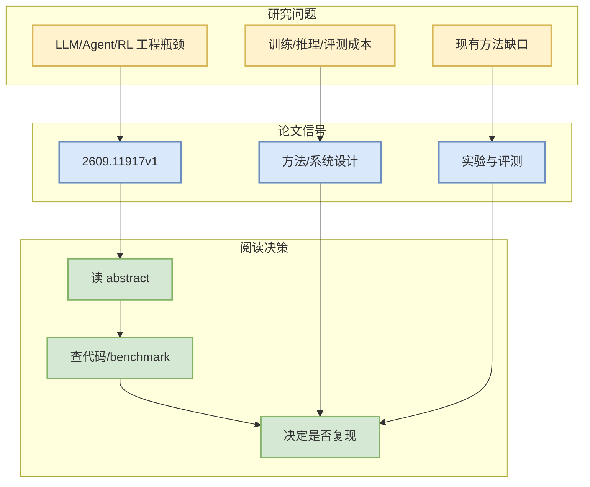

# Data Scarcity and Model Sparsity: Mixtures-of-Experts Overfit More to Repeated Data

> 一句话结论：这是一篇来自 arXiv 的候选论文，主题与 LLM/Agent/RL/AI Infra 相关，建议按摘要先做二次筛选。

## TL;DR
- 论文来源：arXiv
- 来源类型：预印本
- 作者/机构：Atindra Jha, Margaret Li, Jure Leskovec, Percy Liang
- 发布时间：2026-09-10
- abs：https://arxiv.org/abs/2609.11917v1
- PDF：https://arxiv.org/pdf/2609.11917v1
- 代码链接：未发现

## 元信息表
| 字段 | 值 |
|---|---|
| arXiv ID | 2609.11917v1 |
| Categories | cs.LG, cs.CL |
| Authors | Atindra Jha, Margaret Li, Jure Leskovec, Percy Liang |
| Published | 2026-09-10 |
| Abs | https://arxiv.org/abs/2609.11917v1 |
| PDF | https://arxiv.org/pdf/2609.11917v1 |

## 信息压缩图示

## 摘要压缩
As the supply of human-written text is exhausted, it has become standard practice to repeat language model training data. Prior work has studied data repetition for densely activated Transformers, but the effects of data repetition remains largely unexplored for recently dominant sparse architectures such as Mixture-of-Experts (MoE), despite their increased compute efficiency. We vary data repetition rates across single- and multi-domain data mixes, and across MoE settings, including expert count and granularity. We consistently find, for models ranging from 80M to 1B active (8.5B total) parameters, that MoEs degrade more rapidly under data repetition. This effect increases with sparsity, dictated by total rather than active parameters. While 80M dense models can repeat data over 8x with minimal degradation, MoEs instead begin to suffer at 4x, and deteriorate rapidly, ceding their perfor

## 专业解读
本条进入雷达是因为查询词限定在 LLM serving、agent evaluation、post-training、RL/world model 等方向。后续应验证论文是否提供可复现实验、代码或足够清晰的 benchmark。若只是泛 AI 应用而缺少系统/训练/评测贡献，应降级为 skim。

## 对我的影响
- AI Infra：关注是否提供吞吐、延迟、调度或分布式训练信号。
- LLM/Agent：关注是否改善工具调用、评测闭环、上下文管理。
- RL/Game AI：关注是否能迁移到 self-play、环境并行或奖励设计。

## 可信度与局限性
仅基于 arXiv API 摘要；未阅读全文 PDF。

#ai-radar #paper #arxiv
