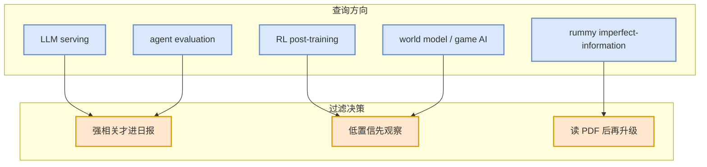

# arXiv 低置信论文观察清单 - 2026-09-14

> 论文来源：arXiv
> 来源类型：预印本索引 / API 观察
> 原文：https://arxiv.org

## 一句话结论
今日 arXiv/API 结果不稳定或低置信；未编造论文结论，保留 Serving、Agent Eval、RL、World Model 和 Rummy/Game AI 查询方向。

## 信息压缩图示

## 候选方向
| 方向 | 今日处理 | 后续动作 |
|---|---|---|
| LLM serving | 低置信观察 | 等 API 恢复后重查 abs/PDF |
| Agent evaluation | 低置信观察 | 确认 benchmark 与代码 |
| RL / post-training | 低置信观察 | 筛 GRPO/PPO/DPO/RLHF 强相关 |
| Rummy/Game AI | 低置信观察 | 优先找 imperfect-information、ISMCTS/MCTS/self-play |

#ai-radar #paper-watchlist
