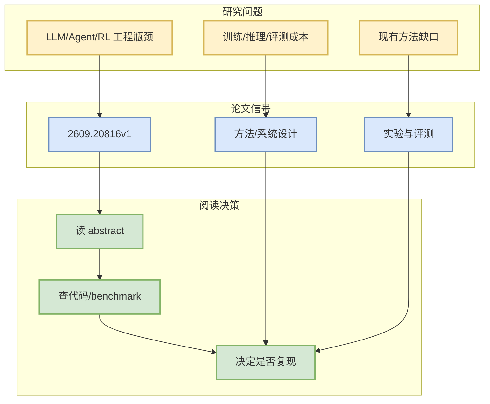

# Paint-Anything: Unified Any-Color Control for Image Generation and Editing

> 一句话结论：这是一篇来自 arXiv 的候选论文，主题与 LLM/Agent/RL/AI Infra 相关，建议按摘要先做二次筛选。

## TL;DR
- 论文来源：arXiv
- 来源类型：预印本
- 作者/机构：Ji Xie, Dewei Zhou, Xinyu Huang, Zhennan Chen
- 发布时间：2026-09-17
- abs：https://arxiv.org/abs/2609.20816v1
- PDF：https://arxiv.org/pdf/2609.20816v1
- 代码链接：未发现

## 元信息表
| 字段 | 值 |
|---|---|
| arXiv ID | 2609.20816v1 |
| Categories | cs.CV, cs.AI, cs.LG |
| Authors | Ji Xie, Dewei Zhou, Xinyu Huang, Zhennan Chen |
| Published | 2026-09-17 |
| Abs | https://arxiv.org/abs/2609.20816v1 |
| PDF | https://arxiv.org/pdf/2609.20816v1 |

## 信息压缩图示

## 摘要压缩
Professional design requires any-color control: the ability to specify an object's target color with any 24-bit hex value for image generation and editing. Prior work has explored color generation, editing, and colorization, but often relies on dedicated color representations or specialized inference procedures. Advances in large language models offer a simpler starting point: even compact models can associate hex values with color semantics. We present Paint-Anything, which learns a shared hex-prompt interface for generation and editing through object-level color supervision. We develop a data pipeline that constructs Paint-500K from real images through object grounding, perceptual color labeling, and editing-pair synthesis. Since shadows make real-image labels only approximate colors, we complement this supervision with pure-color anchors whose pixels exactly match their paired hex val

## 专业解读
本条进入雷达是因为查询词限定在 LLM serving、agent evaluation、post-training、RL/world model 等方向。后续应验证论文是否提供可复现实验、代码或足够清晰的 benchmark。若只是泛 AI 应用而缺少系统/训练/评测贡献，应降级为 skim。

## 对我的影响
- AI Infra：关注是否提供吞吐、延迟、调度或分布式训练信号。
- LLM/Agent：关注是否改善工具调用、评测闭环、上下文管理。
- RL/Game AI：关注是否能迁移到 self-play、环境并行或奖励设计。

## 可信度与局限性
仅基于 arXiv API 摘要；未阅读全文 PDF。

#ai-radar #paper #arxiv
