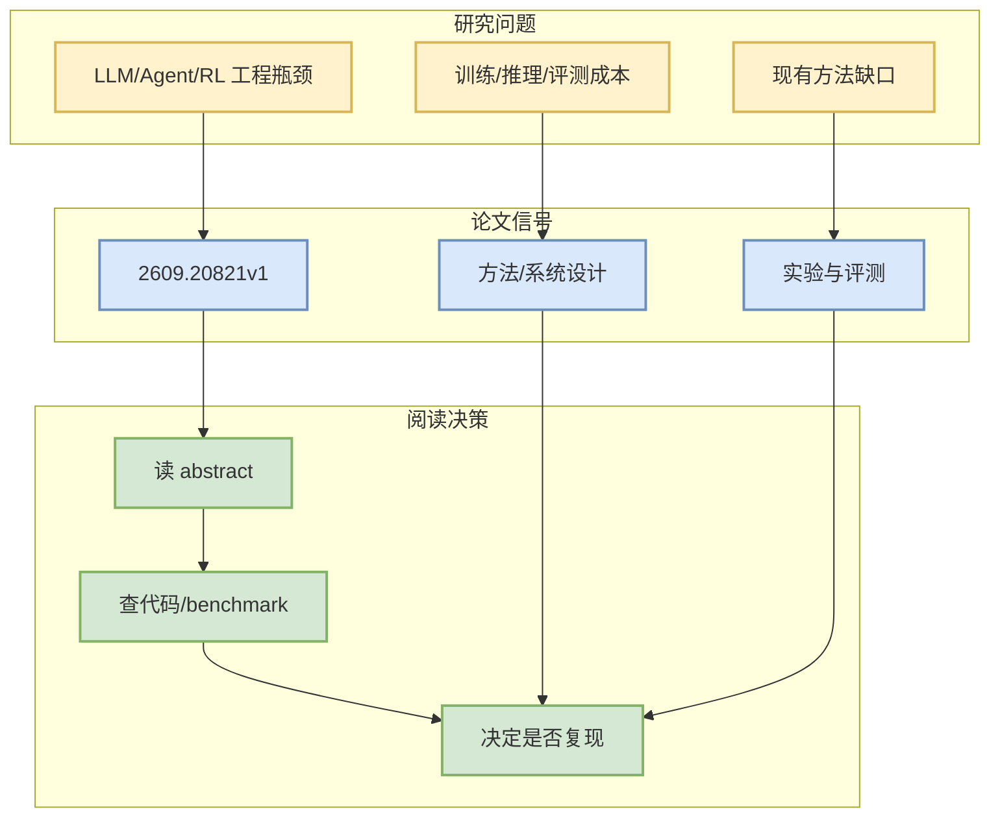

# Embedding Models Measure in Peculiar Ways

> 一句话结论：这是一篇来自 arXiv 的候选论文，主题与 LLM/Agent/RL/AI Infra 相关，建议按摘要先做二次筛选。

## TL;DR
- 论文来源：arXiv
- 来源类型：预印本
- 作者/机构：Juri Opitz, Andrianos Michail
- 发布时间：2026-09-17
- abs：https://arxiv.org/abs/2609.20821v1
- PDF：https://arxiv.org/pdf/2609.20821v1
- 代码链接：未发现

## 元信息表
| 字段 | 值 |
|---|---|
| arXiv ID | 2609.20821v1 |
| Categories | cs.CL, cs.LG |
| Authors | Juri Opitz, Andrianos Michail |
| Published | 2026-09-17 |
| Abs | https://arxiv.org/abs/2609.20821v1 |
| PDF | https://arxiv.org/pdf/2609.20821v1 |

## 信息压缩图示

## 摘要压缩
Embedding spaces define notions of semantic similarity and distance. We study whether those embeddings reflect physical measurements of mass, distance, time and volume, which admit a unique, objective notion of semantic equivalence and distance. We find that physical measurement is only weakly modeled in the embedding space, and that instead quite peculiar measurement patterns can be observed. Further analysis indicates that embedding representations of physical measurements are strongly influenced by superficial string similarity, and recalibration of similarity does not substantially improve the alignment.

## 专业解读
本条进入雷达是因为查询词限定在 LLM serving、agent evaluation、post-training、RL/world model 等方向。后续应验证论文是否提供可复现实验、代码或足够清晰的 benchmark。

## 对我的影响
- AI Infra：关注是否提供吞吐、延迟、调度或分布式训练信号。
- LLM/Agent：关注是否改善工具调用、评测闭环、上下文管理。
- RL/Game AI：关注是否能迁移到 self-play、环境并行或奖励设计。

## 可信度与局限性
仅基于 arXiv API 摘要；未阅读全文 PDF。

#ai-radar #paper #arxiv
