# Towards Understanding LLM-Based Log Anomaly Detection: An Empirical Study of Performance, Efficiency, and Robustness

> 一句话结论：这是一篇来自 arXiv 的候选论文，主题与 LLM/Agent/RL/AI Infra 相关，建议按摘要先做二次筛选。

## TL;DR
- 论文来源：arXiv
- 来源类型：预印本
- 作者/机构：Bin Li, Dongdong Wang, Siyang Lu
- 发布时间：2026-09-25
- abs：https://arxiv.org/abs/2609.31371v1
- PDF：https://arxiv.org/pdf/2609.31371v1
- 代码链接：未发现

## 元信息表
| 字段 | 值 |
|---|---|
| arXiv ID | 2609.31371v1 |
| Categories | cs.LG, cs.CR |
| Authors | Bin Li, Dongdong Wang, Siyang Lu |
| Published | 2026-09-25 |
| Abs | https://arxiv.org/abs/2609.31371v1 |
| PDF | https://arxiv.org/pdf/2609.31371v1 |

## 信息压缩图示

```mermaid
flowchart TB
  subgraph Q[研究问题]
    Q1[LLM/Agent/RL 工程瓶颈]
    Q2[训练/推理/评测成本]
    Q3[现有方法缺口]
  end
  subgraph M[论文信号]
    M1[2609.31371v1]
    M2[方法/系统设计]
    M3[实验与评测]
  end
  subgraph D[阅读决策]
    D1[读 abstract]
    D2[查代码/benchmark]
    D3[决定是否复现]
  end
  Q1 --> M1
  Q2 --> M2
  Q3 --> M3
  M1 --> D1 --> D2 --> D3
  M2 --> D3
  M3 --> D3
  classDef problem fill:#fff2cc,stroke:#d6b656,stroke-width:2px;
  classDef method fill:#dae8fc,stroke:#6c8ebf,stroke-width:2px;
  classDef decision fill:#d5e8d4,stroke:#82b366,stroke-width:2px;
  class Q1,Q2,Q3 problem; class M1,M2,M3 method; class D1,D2,D3 decision;
```

## 摘要压缩
Large language models (LLMs) have demonstrated promising performance in log anomaly detection, yet how their adaptation strategies, architectures, and deployment configurations affect detection effectiveness remains insufficiently understood. To investigate these factors, we conduct a systematic empirical analysis across three public log datasets, examining different adaptation strategies, model architectures, parameter scales, and quantization settings. Our results reveal substantial performance differences across adaptation strategies, while model scaling yields varying detection gains across datasets. We further observe that models with comparable detection accuracy can exhibit markedly different computational costs, and that low-bit quantization largely preserves detection performance in the evaluated configurations. Finally, we examine detection robustness under structural, semantic

## 专业解读
本条进入雷达是因为查询词限定在 LLM serving、agent evaluation、post-training、RL/world model 等方向。后续应验证论文是否提供可复现实验、代码或足够清晰的 benchmark。若只是泛 AI 应用而缺少系统/训练/评测贡献，应降级为 skim。

## 对我的影响
- AI Infra：关注是否提供吞吐、延迟、调度或分布式训练信号。
- LLM/Agent：关注是否改善工具调用、评测闭环、上下文管理。
- RL/Game AI：关注是否能迁移到 self-play、环境并行或奖励设计。

## 可信度与局限性
仅基于 arXiv API 摘要；未阅读全文 PDF。

#ai-radar #paper #arxiv
