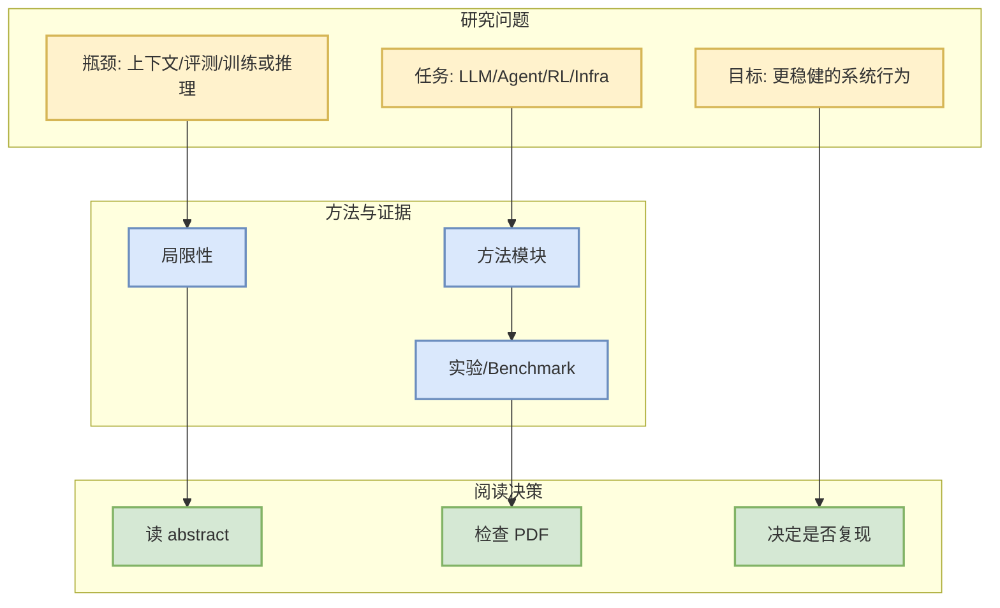

# Transfer Learning for Edge Classification on Dynamic Text-Attributed Graphs

> 日期：2026-09-29  
> 论文来源：arXiv  
> 来源类型：预印本  
> 发布时间：2026-09-26  
> 作者/机构：Tyler Bonnet, Marek Rei  
> abs：https://arxiv.org/abs/2609.32849v1  
> PDF：https://arxiv.org/pdf/2609.32849v1  
> 代码链接：未发现

## 一句话结论
该论文与 LLM/Agent/RL/Serving 相关，适合作为今日 skim 候选；是否必读需要进一步读 PDF 验证实验强度。

## TL;DR
Learning transferable representations for dynamic text-attributed graphs (DyTAGs) requires models to capture underlying interaction dynamics that persist across domains. However, existing methods tend to overfit to domain-specific structural, temporal, and semantic patterns, limiting edge classification performance under distribution shifts. To expose and address this, we formally establish a leave-one-domain-out (LODO) transfer learning protocol for edge classification on DyTAGs. Under this pro

## 信息压缩图示

## 专业解读
- 类别：cs.LG, cs.AI, cs.SI
- 对 AI Infra/Agent/RL 的潜在价值：若论文给出可复现 benchmark、训练/推理流程或 eval 方法，则值得纳入后续深读。
- 当前限制：仅基于 arXiv metadata 与摘要自动筛选，未完整解析 PDF。

## 对我的影响
可用于补充 serving、agent eval、post-training 或 game AI 的研究 radar；今天先放入观察/skim。

## 相关链接
- [abs](https://arxiv.org/abs/2609.32849v1)
- [PDF](https://arxiv.org/pdf/2609.32849v1)
- 今日日报：[[Daily/2026-09-29]]

#ai-radar #paper #arxiv
