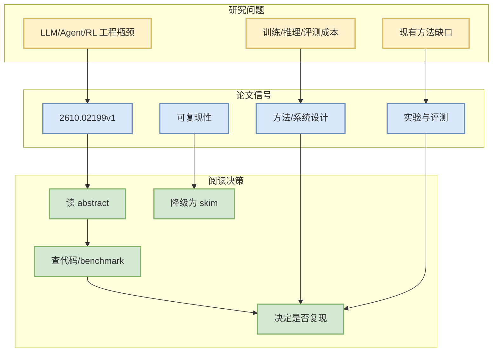

# TACO: Ternary Absolute-max Column-wise One-sparse Optimizer for LLM Fine-Tuning

> 一句话结论：这是一篇来自 arXiv 的候选论文，主题与 LLM/Agent/RL/AI Infra 相关，建议按摘要先做二次筛选。

## TL;DR
- 论文来源：arXiv
- 来源类型：预印本
- 作者/机构：Jichao Jiang, Cristian McGee, El Houcine Bergou, Hanqin Cai, Aritra Dutta
- 发布时间：2026-10-01
- abs：https://arxiv.org/abs/2610.02199v1
- PDF：https://arxiv.org/pdf/2610.02199v1
- 代码链接：未发现

## 元信息表
| 字段 | 值 |
|---|---|
| arXiv ID | 2610.02199v1 |
| Categories | cs.LG, math.OC |
| Authors | Jichao Jiang, Cristian McGee, El Houcine Bergou, Hanqin Cai, Aritra Dutta |
| Published | 2026-10-01 |
| Abs | https://arxiv.org/abs/2610.02199v1 |
| PDF | https://arxiv.org/pdf/2610.02199v1 |

## 信息压缩图示

## 摘要压缩
Full-parameter fine-tuning of large language models (LLMs) incurs substantial optimizer state memory overhead, limiting the model sizes that fit on modern GPUs. Existing approaches either compress optimizer state, abandon first-order gradients, or change the update geometry while retaining dense state. The recently introduced Muon optimizer reduces optimizer memory through matrix-valued updates. Still, its geometry differs from AdamW and can lead to performance degradation when fine-tuning AdamW-pretrained models. To reduce optimizer memory without sacrificing accuracy or computational efficiency in LLM fine-tuning, we propose Ternary Absolute-max Column-wise One-sparse optimizer, or TACO, which follows Muon's operator-norm steepest-descent view but takes the geometric route further. TACO computes the exact steepest-descent direction under a dimension-normalized $1\to1$ operator norm by selecting the sign of the largest magnitude entry in each column of two-dimensional weight matrices.

## 专业解读
本条进入雷达是因为查询词限定在 LLM serving、agent evaluation、post-training、RL/world model 等方向。后续应验证论文是否提供可复现实验、代码或足够清晰的 benchmark。若只是泛 AI 应用而缺少系统/训练/评测贡献，应降级为 skim。

## 对我的影响
- AI Infra：关注是否提供吞吐、延迟、调度或分布式训练信号。
- LLM/Agent：关注是否改善工具调用、评测闭环、上下文管理。
- RL/Game AI：关注是否能迁移到 self-play、环境并行或奖励设计。

## 可信度与局限性
仅基于 arXiv API 摘要；未阅读全文 PDF。

#ai-radar #paper #arxiv
